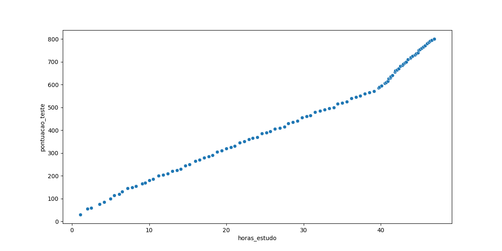

# Modelo: Horas de Estudo x Pontuação num exame
Um modelo em regressão linear para prever quantas horas uma pessoa deve estudar para obter uma certa pontuação em um teste.
## Sobre o projeto
1. Trata de uma análise exploratória de dados para verificar a aparente linearidade dos dados. Feita com pandas, seaborn e matplotlib.
2. Com o gráfico scatter, é possível notar uma correlação positiva dos dados, levando à adoção de um modelo de regressão linear.
3. Após o treinamento do modelo, há uma análise da qualidade do modelo, usando métricas como erro médio absoluto, erro médio na raíz quadrada.
4. Faz-se uma análise dos resíduos da solução, olhando seu testes de normalidade para ver se estão próximos a uma distribuição normal.
5. Usa joblib para salvar o modelo para consumo em um arquivo .pkl. ESse consumo é feito pela API criada com FastAPI.
## Tecnologias usadas
1. Python
2. Scikit-Learn
3. Seaborn
4. Matplotlib
5. Pandas
6. Scipy
7. FastAPI
8. Uvicorn
9. Joblib
10. Pingouin
### Como preparar o ambiente
```bash
pipenv sync
pipenv shell
```
### Como rodar em forma de api
```bash
uvicorn api_modelo_regressao:app --reload
```
### Como rodar o model.py
```bash
python model.py
```
## Conclusão do Modelo Treinado

### Análise do cenário
Como os dados mostram em um certo ponto por volta de 40h de estudo, o coeficiente fica maior, mostrando que o dataset poderia ser dividido em 2 intervalos. Como esse modelo é treinado usando todo o dataset, a crítica para ele seria separá-lo em 2 para abordar corretamente ambos os cenários.
### Análise de dados
O Root Mean Squared Error é de aproximadamente 27.7 pontos, ou seja, um erro de 27,7 ponto em média. Se o resultado máximo da prova for 800 como no caso, esse erro equivale a aproximadamente 3.5% da nota total, o que tona o modelo bom, apesar de ter 2 cenários diferentes. Contudo, a posição final ṕe que ele seria ainda melhor se fosse dividido em 2: um modelo antes das 40h de estudo, e outro a partir das 40h de estudo.
### Créditos
Pedro Malini, Abril de 2026 