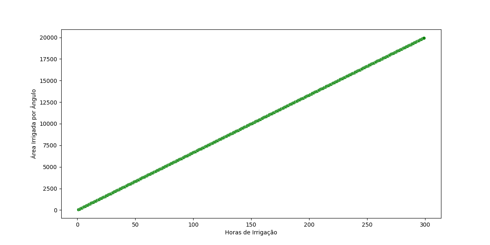

# Modelo: Horas de Irrigação x Área Irrigada
Um modelo em regressão linear para prever quantas horas uma área deve ser irrigada para atingir um certo tamanho.
## Sobre o projeto
1. Trata de uma análise exploratória de dados para verificar a aparente linearidade dos dados. Feita com pandas, seaborn e matplotlib.
2. Com o gráfico scatter, é possível notar uma correlação positiva dos dados, levando à adoção de um modelo de regressão linear.
3. Após o treinamento do modelo, há uma análise da qualidade do modelo, usando métricas como erro médio absoluto e erro médio na raíz quadrada.
4. Faz-se uma análise dos resíduos da solução, olhando seu testes de normalidade para ver se estão próximos a uma distribuição normal.
5. Usa joblib para salvar o modelo para consumo em um arquivo .pkl. Esse consumo pode ser feito pelo uso da api com fastapi.
## Tecnologias usadas
1. Python
2. Scikit-Learn
3. Seaborn
4. Matplotlib
5. Pandas
6. Scipy
7. FastAPI
8. Uvicorn
9. Joblib
10. Pingouin
### Como preparar o ambiente
```bash
pipenv sync
pipenv shell
```
### Como rodar em forma de api
```bash
uvicorn api_modelo_regressao:app --reload
```
### Como rodar o model.py
```bash
python model.py
```
## Conclusão do Modelo Treinado

### Análise do cenário
Os dados tem uma correlação de Pearson em grau 1. Ou seja, elas são perfeitamente lineares. Assim, o modelo de regressão linear é completamente útil para a previsibilidade do cenário. Possivelmente uma melhoria seria trazer mais dados, já que só há 300 registros.
### Análise de dados
O Root Mean Squared Error é de aproximadamente 0 m², ou seja, o modelo praticamente não erra. O erro está na décima segunda casa decimal, logo é perfeitamente arredondável para ser utilizado. A título de exemplo, a previsibilidade de 15h gera 9999.999999, errando por 2 pontos na decima segunda casa decimal.
### Créditos
Pedro Malini, Abril de 2026 