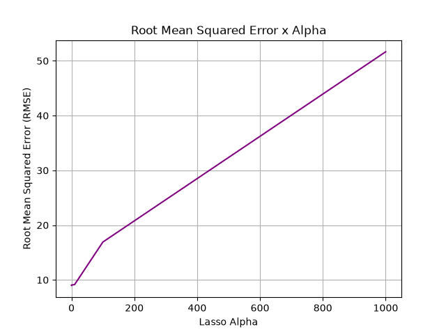
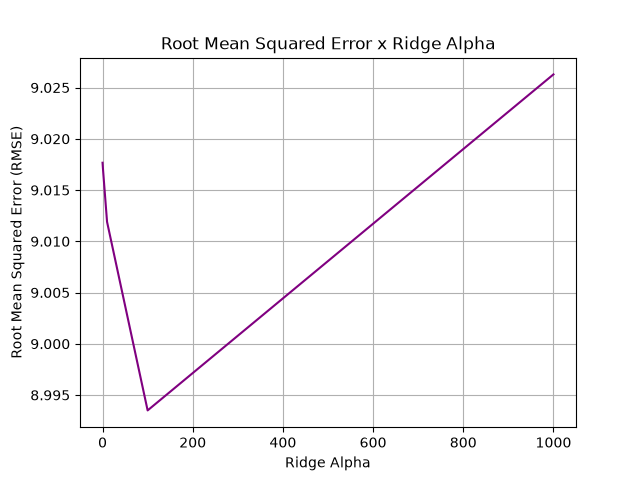

# Regularização: Lasso e Ridge

## Resumo
Estudo de regularização com Lasso, LassoCV, Ridge e RidgeCV

## Resultados
### Lasso

|Alpha|0.01|0.1|1|10|100|1000|
|:-:|:-:|:-:|:-:|:-:|:-:|:-:|
|Root Mean Squared Error (RMSE)|9.01|8.96|9.06|9.14|16.91|51.65|

Observação: com o aumento do alpha(força da regularização), os coeficientes tendem a ficar mais próximos de 0. Contudo, os coeficientes mais relevantes foram os últimos a serem zerados.

### Ridge

|Alpha|0.01|0.1|1|10|100|1000|
|:-:|:-:|:-:|:-:|:-:|:-:|:-:|
|Root Mean Squared Error (RMSE)|≃9.01|≃9.01|≃9.01|≃9.01|≃8.99|≃9.02|

Observação: com o aumento do alpha(força da regularização), os coeficientes os coeficientes tendem a ficar mais balanceados entre si, embora isso não signifique uma melhora no modelo.