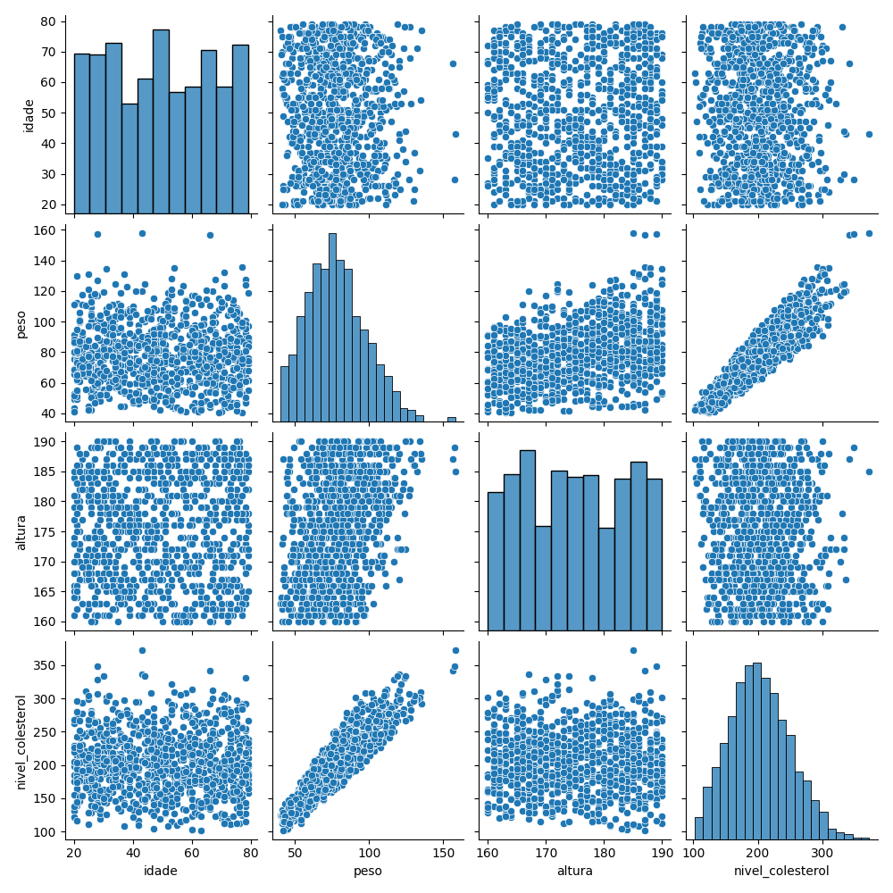
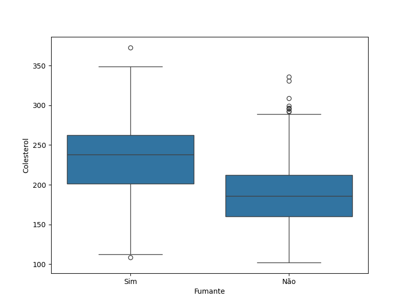
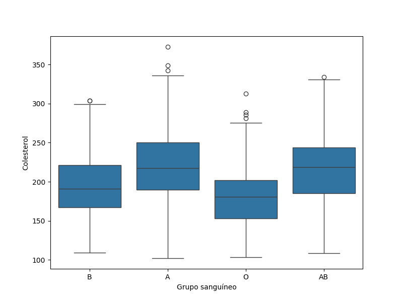
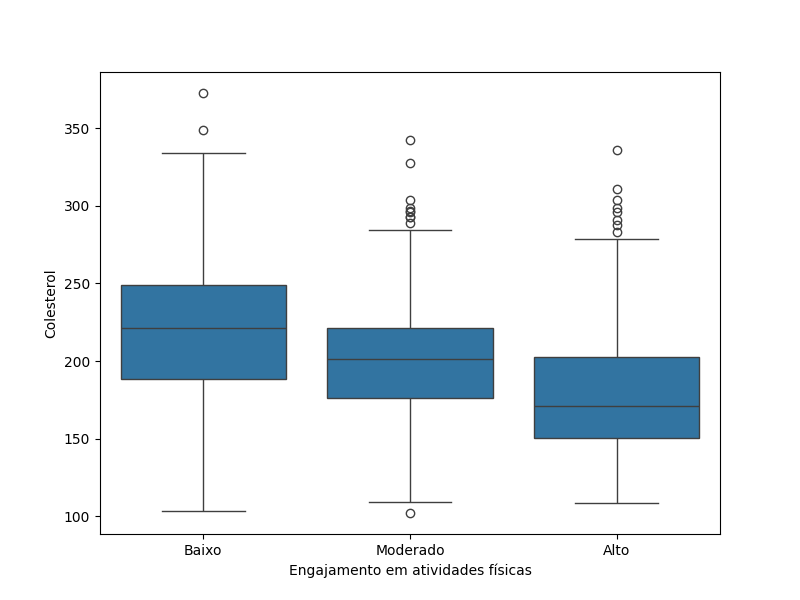
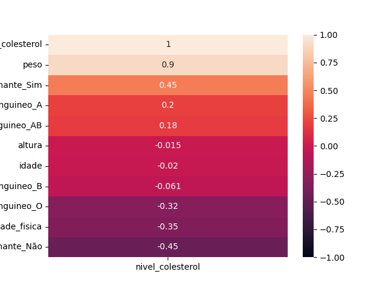
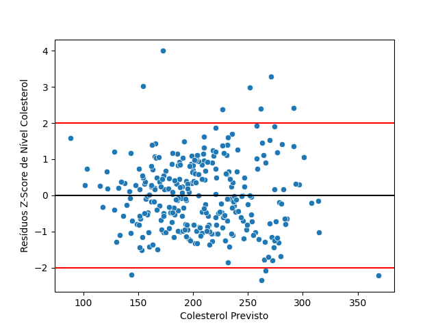
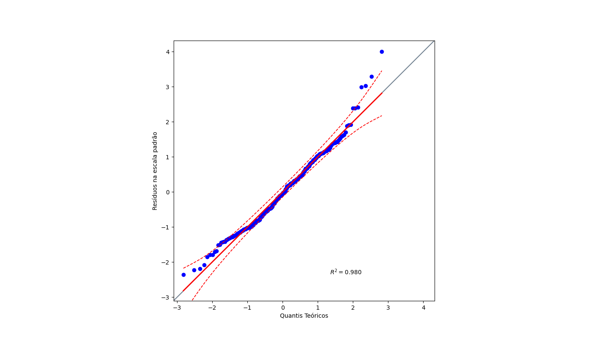
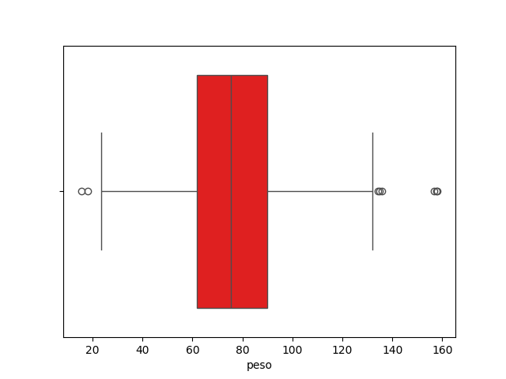

# Modelo: Previsibilidade de COlesterol de acordo com dados
Um modelo em **Regressão Linear Múltipla** para prever qual o nível de coletserol de uma pessoa de acordo com seus dados, sendo estes:
+ Idade
+ Peso
+ Altura
+ Fumante (Sim/Não)
+ Tipo Sanguíneo (A/B/C/AB)
+ Frequência de Atividade Física (Baixa/Média/Alta)
## Sobre o projeto
1. Trata de uma análise exploratória de dados para verificar a relação dos dados com a variável target colesterol. Feita com pandas, seaborn e matplotlib.
2. Com o pairplot, é possível notar a relação entre as variáveis. Além disso, com o heatmap das correlações é possível ver quais variáeveis independentes tem mais realação de pearson com a quantidade de colesterol.
3. Após o treinamento do modelo, há uma análise da qualidade do modelo, usando métricas como erro médio absoluto, erro médio na raíz quadrada e r2_score.
4. Faz-se uma análise dos resíduos da solução, olhando seu testes de normalidade e de homocedasticidade para ver se estão próximos a uma distribuição normal.
5. Usa joblib para salvar o modelo para consumo em um arquivo .pkl. ESse consumo é feito pelo APP criado com Gradio.
## Tecnologias usadas
1. Python
2. Scikit-Learn
3. Seaborn
4. Matplotlib
5. Pandas
6. Scipy
7. Gradio
8. Joblib
9.  Pingouin
### Como preparar o ambiente
```bash
pipenv sync
pipenv shell
```
### Como testar em forma de aplicação web
```bash
python app_gradio_colesterol.py
```
### Como rodar o código que gera o modelo
```bash
python model.py
```
## Aspectos do Modelo Treinado
### Análise do cenário

#### Variáveis numéricas
Pelo pairplot é possível enxergar que em termos das variáveis numericas, a altura e a idade não formam uma relação linear com o colesterol. Em compensação, o peso forma uma correlação linear positiva claramente. Quanto aos histogramas, percebe que os dados de idade e altura se encontram em uma distribuição aproximadamente uniforme, enquanto o peso e o colesterol formam uma distribuição normal.
#### Variávies categóricas



<br />
Quanto à pessoa fumar, o gráfico é claro em que o fato de fumar eleva a possibilidade da pessoa ter mais colesterol. Já sobre a pessoa fazer atividades físicas, há uma correlação negativa, em que caso a pessoa seja muito engajada em atividades físicas, ela tende a ter menos colesterol. Em termos do grupo sanguíneo, aparentemente ser do grupo O ou B torna a pessoa propensa a ter menos colesterol, já ser do grupo A ou AB, o contrário ocorre.

### Correção dos dados e outliers


Há outliers no peso das pessoas, onde há pessoas com 15kg ou menos. Para o fim da pesquisa, considerando que a idade mínima é de 20 anos, levou-se em consideração somente pesos acima ou igual a 40kg. Nas colinas fumante, nível de atividade física e grupo sanguíneo, usou-se a moda para substituir os valores faltantes. Já nas colunas idade, peso e altura, usou-se a mediana. Na idade e na altura se justifica em razão de a média não ser um valor inteiro já no caso do peso, a mediana era próxima da média, então acompanhou as outras variáveis numéricas com a escolha da mediana.<br />
Ao final, usou-se dummies para as colunas grupos sanguíneos e fumante, já que são variáveis categóricas nominais. Enquanto para atividade física, por ser uma variável categórica ordinal, usou-se o mapeamento de Baixo, Moderado e Alto para 1, 2, 3.<br>
Pelo heatmap, vê-se que as variáveis mais correlacionadas linearmente pelo coeficiente de **Pearson** são o peso, o fato de o paciente fumar ou não e quão ela pratica atividades físicas.
### Treinamento do modelo
Usou-se um dataset com 70% dos dados para treinamento e 30% para testes, e o modelo escolhido foi a regressão linear múltipla.
### Métricas do modelo
#### Métricas de linearidade e de outliers

1. Outliers: Pelos scatter dos resíduos, vê-se 11 de 300 pontos fora do intervalo +-2, logo há poucos outliers. 
2. Modelo linear adequado e homocedasticidade: Os resíduos estão espalhados sem formar um padrão, o que indica que o modelo linear é adequado.
#### Métricas do modelo
| R²-Score| Root Mean Squared Error (RMSE) | Mean Absolute Error (MAE) |
|:---------:|:------:|:--------:|
| ≃ 0.96 |≃ 9.10|≃ 7.31|

+ O R²-Score mostra que a variabilidade dos dados é bem explicada pelo modelo linear, já que está bem próximo de 1.
+ O RMSE penaliza mais erros grandes devido à elevação ao quadrado das diferenças, sendo sensível a outliers. O valor obtido (~9.10) indica o erro médio na mesma unidade do colesterol.
+ O MAE mostra que o modelo erra em média 7.31 de colesterol. Isso pode ser considerado baixos ou alto a depender do contexto clínico e da população.
#### Métricas de Normalidade dos Resíduos
| P-valor de Shapiro-Wilk | P-valor de Kolmogorov-Smirnov | P-valor de Lilliefors | Anderson 5% |
|:--:|:--:|:--:|:--:|
|≃ 0.006|≃ 8*10⁻⁴⁸|≃0.12|stat > critical|

> **H0**: *os resíduos seguem uma distribuição normal*<br/>
> **H1**: *os resíduos não seguem uma distribuição normal*
- Por ser abaixo de 0.05, Shapiro-Wilk e Kolmogorov-Smirnov rejeitam a hipótese nula por haver evidência de distribuição não normal nos resíduos. OBS: Kolmogorov-SMirnov rejeitam fortemente.
- Por ser acima de 0.05, Lilliefors aponta evidência de distribuição normal dos resíduos, logo não há evidência suficiente para rejeitar a hipótese nula.
- Por stat > critical, Anderson-Darling rejeita a hipótese nula por haver evidência de distribuição não normal nos resíduo.

O QQ-plot apresenta forte alinhamento dos resíduos à linha teórica (R² ≈ 0.98), indicando aproximação à normalidade, apesar de testes formais apontarem desvios estatisticamente significativos.<br>
**Por que isso acontece?**<br>
Isso ocorre pois os testes estatísticos são muito sensíveis a outliers. Nos dados há alguns outliers sobretudo com os pesos dos pacientes, logo é possível explicar o porquê desses outliers existirem no qqplot de resíduos.
#### Métricas de Homocedasticidade
|P-Value de Goldfeld |
|:--:|
|≃ 0.98|

> **H0**: *os resíduos seguem uma variação constante (há homocedasticidade)*<br/>
> **H1**: *os resíduos não seguem uma variação constante (há heterocedasticidade)*

Por ser acima de 0.05, o teste de Goldfeld aponta evidência de uma variância aproximadamente constante dos resíduos, logo não rejeita a hipótese nula.
>*OBS: Scatterplot resíduos x colesterol previsto mostra resíduos espalhados sem formar um padrão, o que já indica homocedasticidade*

### Conclusão
O modelo ajustado segue uma regressão linear múltipla onde o colesterol é explicado por uma combinação linear das variáveis transformadas (padronizadas e codificadas), com interceptor de aproximadamente 203.71 e maior influência do peso (coeficiente positivo elevado). 
#### Melhorias


Uma possível melhoria seria extrair mais dados de pessoas com pesos acima de 130 kg, já que atualmente essa faixa cumpre como outlier do modelo, mas ainda sim é importante para os seus cálculos.
### Créditos
Pedro Malini, 2 de Maio de 2026 