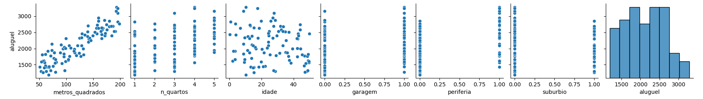
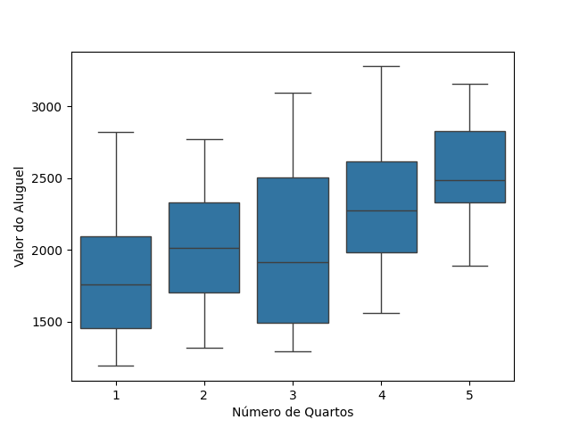
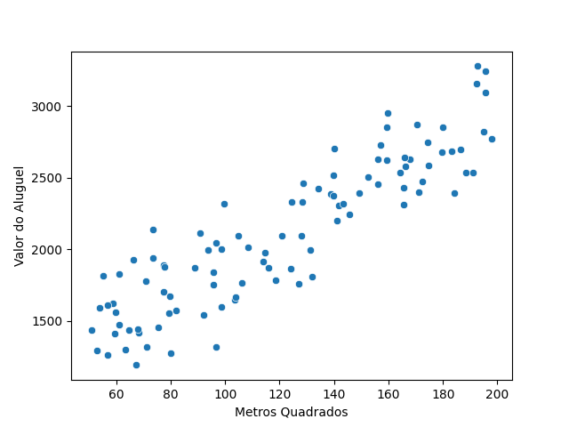
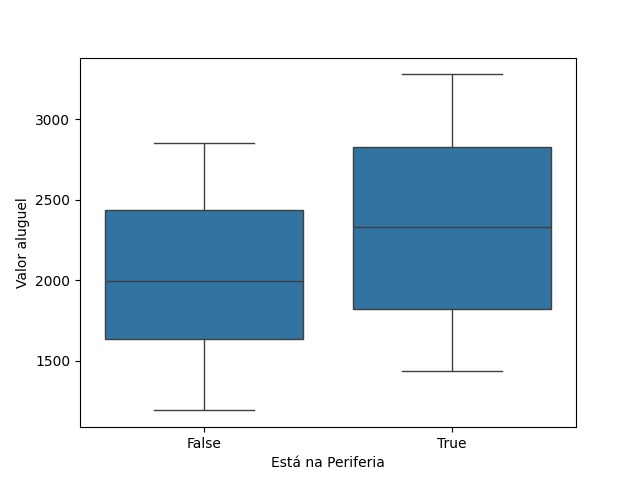
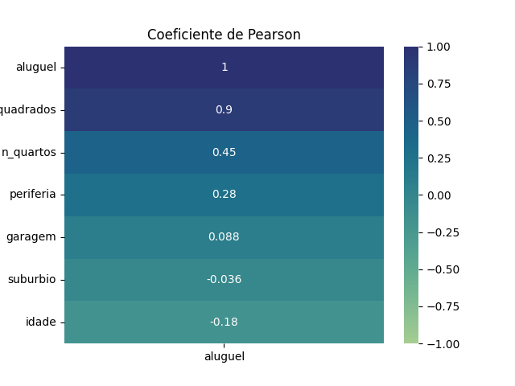
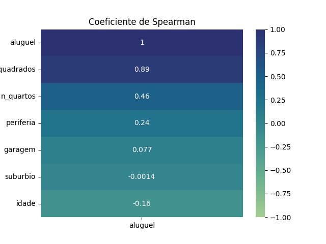
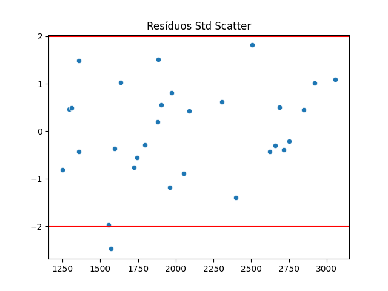
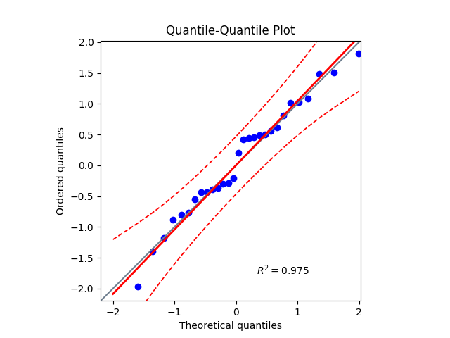

# Modelo de regressão linear múltipla: previsibilidade de valor de aluguel
Um modelo em **regressão linear múltipla** para prever o valor do aluguel de um imóvel com base em suas características, sendo estas:
+ Tamanho em metros quadrados.
+ Número de quartos.
+ Idade do imóvel.
+ Tem garagem (0/1).
+ Está na periferia.
+ Está em subúrbio.
## Sobre o projeto
1. Trata de uma análise exploratória de dados para verificar a relação dos dados com a variável target colesterol. Feita com pandas, seaborn e matplotlib.
2. Com o pairplot, é possível notar a relação entre as variáveis. Além disso, com o heatmap das correlações é possível ver quais variáeveis independentes tem mais realação de pearson com a quantidade de colesterol.
3. Após o treinamento do modelo, há uma análise da qualidade do modelo, usando métricas como erro médio absoluto, erro médio na raíz quadrada e r2_score.
4. Faz-se uma análise dos resíduos da solução, olhando seu testes de normalidade e de homocedasticidade para ver se estão próximos a uma distribuição normal.
5. Usa joblib para salvar o modelo para consumo em um arquivo .pkl. ESse consumo é feito pelo APP criado com Gradio.
## Tecnologias usadas
1. Python
2. Scikit-Learn
3. Seaborn
4. Matplotlib
5. Pandas
6. Scipy
7. Gradio
8. Joblib
9.  Pingouin
### Como preparar o ambiente
```bash
pipenv sync
pipenv shell
```
### Como testar em forma de aplicação web
```bash
python app_model_aluguel.py
```
### Como rodar o código que gera o modelo
```bash
python model_aluguel.py
```
## Aspectos do Modelo Treinado
### Análise do cenário

#### Variáveis numéricas



Pelo pairplot é possível enxergar que em termos das variáveis numericas que o *número de quartos* afeta o aluguel, e, principalmente, os *metros quadrados* afetam o valor do aluguel, em que ambas mostram uma correlação positiva. Enquanto isso a *idade* não apresenta uma correlação clara com o valor do aluguel.

#### Variávies categóricas


Embora afete pouco, é possível notar que não estar na periferia aumenta o aluguel. Já o resto das variáveis categóricas afeta pouco o modelo por não mostrarem uma correlação forte com o aluguel.

#### Por que um modelo linear ?




Pelas imagens é possível ver que a correlação de *Pearson* é mais forte que a de *Spearman*, pois seus resultados são mais distantes de 0. Isto é uma evidência de que o modelo linear é mais indicado para este cenário.

### Correção dos dados e outliers

Pela descrição das métricas, é possível notar que não há outliers numéricos ou não numéricos no modelo. Além disso, não há dados faltantes. Isso significa que não há um imóvel com metros quadrados estranhos, valores fora do normal ou número de quartos impossíveis. As variáveis categóricas sempre assumem True ou False, logo é possível dizer que estão dentro do esperado.

### Treinamento do modelo
Usou-se um dataset com 70% dos dados para treinamento e 30% para testes, e o modelo escolhido foi a *Regressão Linear Múltipla*.

A técnica de transformer foi por colunas categóricas com OneHotEncoder, e colunas numéricas com StandardScaler. Por não haver colunas categóricas ordinais, não foi preciso usar colunas categóricas ordinais com OrdinalEncoder.

Com isso, houve o preprocessamento dos dados com o Column Transformer e a aplicação do modelo de regressão linear.

### Métricas do modelo
#### Métricas de linearidade e de outliers

1. **Outliers**: Pelos scatter dos resíduos, vê-se 1 de 30 pontos fora do intervalo +-2, logo há somente 1 outlier. 
2. Modelo linear adequado e ***homocedasticidade***: Os resíduos estão espalhados sem formar um padrão, o que indica que o modelo linear é adequado.

#### Métricas do modelo
| R²-Score| Root Mean Squared Error (RMSE) | Mean Absolute Error (MAE) |
|:---------:|:------:|:--------:|
| ≃ 0.992 |≃ R$ 50.46|≃ R$ 40.16|

+ O R²-Score mostra que a variabilidade dos dados é bem explicada pelo modelo linear, já que está bem próximo de 1.
+ O RMSE penaliza mais erros grandes devido à elevação ao quadrado das diferenças, sendo sensível a outliers. O valor obtido (~R$ 50.46) indica um erro baixo. A título de exemplo, 50 reais corresponde a 5% do aluguel mais barato do dataset.
+ O MAE mostra que o modelo erra em média BRL 40.16. Isso pode ser considerado baixo pela mesma razão do RMSE.
#### Métricas de Normalidade dos Resíduos
| P-valor de Shapiro-Wilk | P-valor de Kolmogorov-Smirnov | P-valor de Lilliefors |
|:--:|:--:|:--:|
|≃ 0.68|≃ 1.7*10⁻⁸|≃0.24|

> **H0**: *os resíduos seguem uma distribuição normal*<br/>
> **H1**: *os resíduos não seguem uma distribuição normal*
- Por ser abaixo de 0.05, Kolmogorov-Smirnov rejeita a hipótese nula por haver evidência de distribuição não normal nos resíduos. OBS: Kolmogorov-Smirnov rejeita fortemente por ser muito próximo de 0.
- Por ser acima de 0.05, Shapiro-Wilk e Lilliefors apontam evidência de distribuição normal dos resíduos, logo ambas estatísticas não fornecem evidência suficiente para rejeitar a hipótese nula.



O QQ-plot apresenta alinhamento dos resíduos à linha teórica (R² ≈ 0.975), indicando aproximação à normalidade, apesar de testes formais apontarem desvios estatisticamente significativos.

**Por que isso acontece?**

Isso ocorre pois os testes estatísticos são muito sensíveis a outliers. Nos dados residuais há 1 outlier por exemplo, logo é possível explicar o porquê dessas estatísticas formais não indicarem evidência de distribuição normal.

#### Métricas de Homocedasticidade
|P-Value de Goldfeld |
|:--:|
|≃ 0.91|

> **H0**: *os resíduos seguem uma variação constante (há homocedasticidade)*<br/>
> **H1**: *os resíduos não seguem uma variação constante (há heterocedasticidade)*

Por ser acima de 0.05, o teste de Goldfeld aponta evidência de uma variância aproximadamente constante dos resíduos, logo não rejeita a hipótese nula.

>*OBS: Scatterplot resíduos x valor de aluguel previsto mostra resíduos espalhados sem formar um padrão, o que já indica homocedasticidade*

### Conclusão
O modelo ajustado segue uma regressão linear múltipla onde o valor do aluguel é explicado por uma combinação linear das variáveis transformadas (padronizadas e codificadas). As métricas mostram boa explicação do dataset pelo modelo com R² Score próximo de 1 e erros toleráveis.

#### Melhorias
Uma possível melhoria clara é ter mais dados, visto que só há 100 registros no dataset.

Além disso, outros fatores afetam um aluguel, como período do ano, eventos que podem ocorrer na data, os estabelecimentos próximos a ele, estar numa zona nobre da cidade e entre outros fatores.

### Créditos
Pedro Malini, 4 de Maio de 2026 