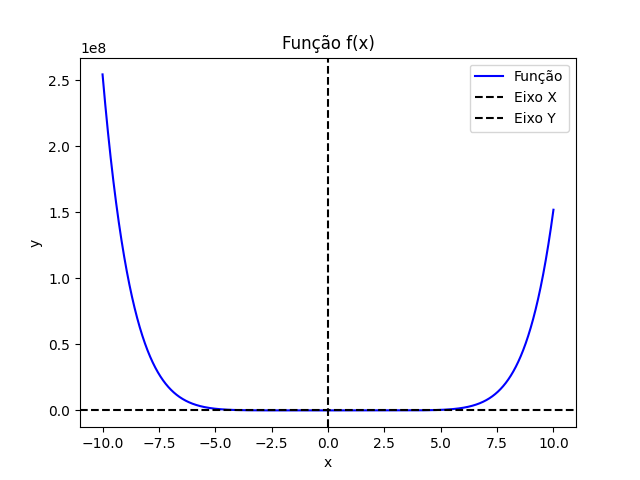
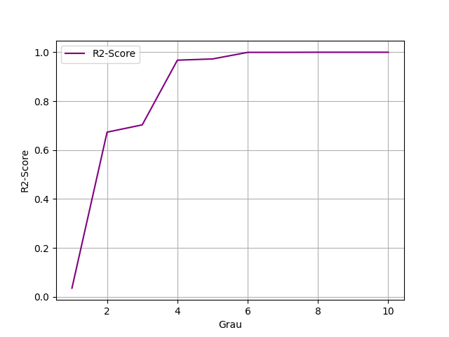
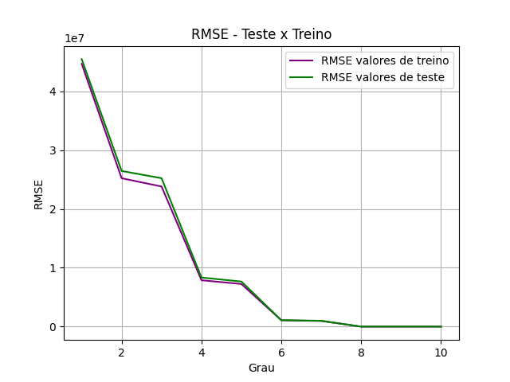

# Regressão Polinomial Função de grau 8


## Resumo
Um modelo em **Regressão Polinomial** para mostrar como ele é capaz de explicar uma função de grau 8. A função escolhida foi: y=2x⁸−5x⁷+3x⁶−12x⁵+7x⁴−9x³+4x²−6x+10.

O dataframe foi gerado com 4000 dados criados de forma artifical da função.

## Tecnologias usadas
1. Python
2. Scikit-Learn
3. Seaborn
4. Matplotlib
5. Pandas
6. Scipy

## Rodar o projeto
```bash
pipenv sync
pipenv shell
python modelo.py
```
## A função


## Treinamento do modelo
Simulou-se o modelo para 10 graus polinomiais. Usou-se o Standard Scaler no Column Transformer para normalizar os dados no eixo x. O modelo polinomial é um pipeline formado por:
1. preprocessador(Transformers)
2. Features polinomiais
3. Modelo de regressão linear.

## Métricas
A métrica escolhida foi Root Mean Squared Error(**RMSE**). A métrica foi usada para ver se o modelo conseguia prever tanto os dados de treino quanto os dados de teste. Outra métrica usada foi o R2-Score, para ver o quanto o modelo era capaz de prever os dados de teste.

### R2-Score por grau


|Grau|1|2|3|4|5|6|7|8|9|10|
|:-:|:-:|:-:|:-:|:-:|:-:|:-:|:-:|:-:|:-:|:-:|
|-|≃ 0.035|≃ 0.673|≃ 0.703|≃ 0.968|≃0.972|≃ 0.999|≃ 1| 1|1|1|

> Com certeza, a partir do grau 9 e 10, os coeficientes de x⁹ e x¹⁰ se tornam 0, e por isso o modelo continua funcionando perfeitamente.

### RMSE por grau (Teste x Treino)


Ao chegar ao grau 8, o modelo não erra mais. logo o RMSE se torna 0 a partir daí. ALém disso vê-se que os erros dos modelos ficam parecidos para ambos os valores, logo as retas vâo convergindo ao longo do tempo, até que a partir do grau 8 a convergência é total.

## Créditos
Pedro Malini, 7 de Junho de 2026 
