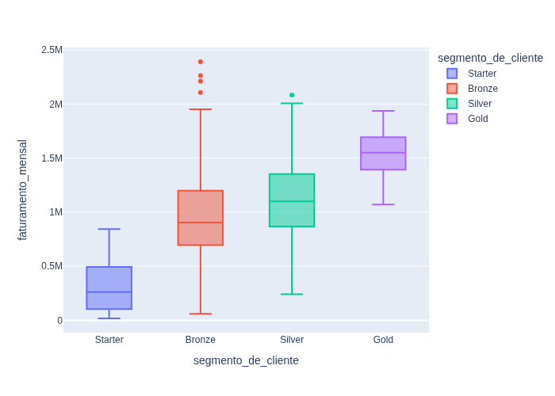
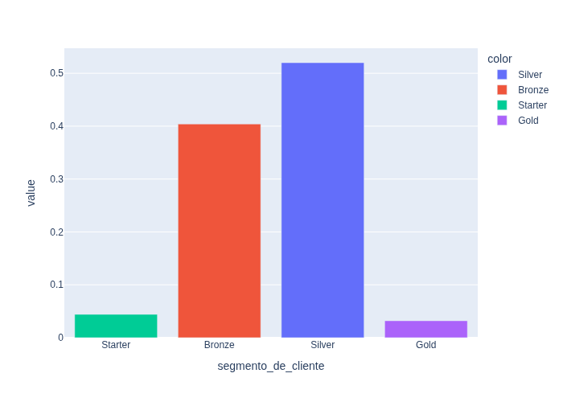
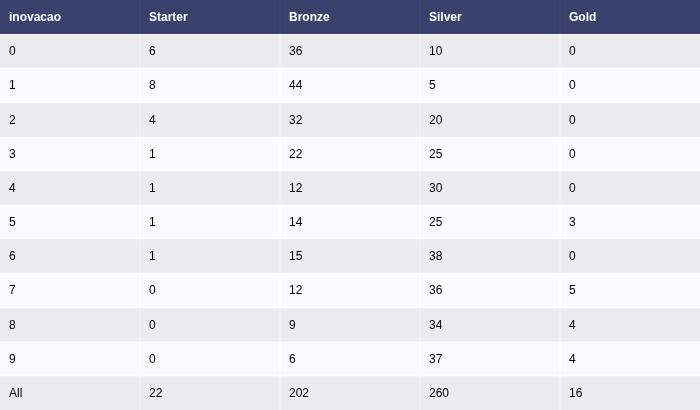
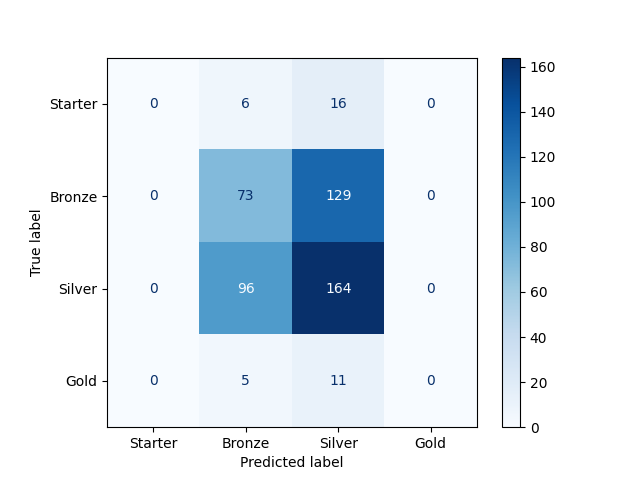
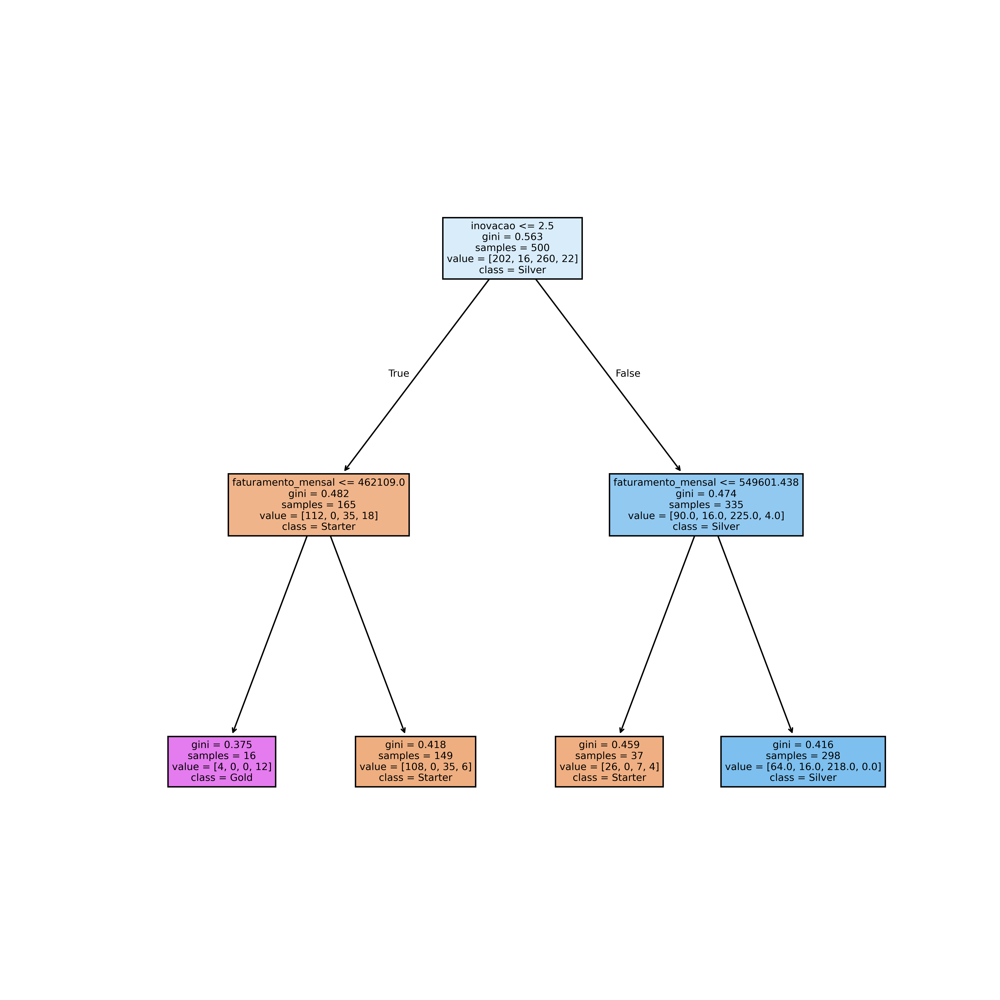

# Modelo: Árvore de Decisão
Um modelo em **Árvore de Decisão** para prever qual a classe de uma empresa em serviços de consultoria, a partir de seus dados:
+ Tipo de atividade economica
+ Faturamento Mensal
+ Número de funcionários
+ Cidade
+ Idade
+ Grau de inovação

O objetivo é definr se a empresa assina o plano Starter, Bronze, Silver ou Ouro.

## Sobre o projeto
1. Trata de uma análise exploratória de dados para verificar a relação dos dados com a variável target. Feita com pandas, plotly e matplotlib.
2. Embora seja analisada a relação das variáveis, usa-se todas as variáveis para título de introdução aos algoritmos de classificação.
3. O treinamento do modelo é feito com Stratified K-Folds e tunning de hiperparâmetros com Optuna.
4. Após o treinamento do modelo, há uma análise da qualidade do modelo, usando métrica de **Acurácia** principalmente para efeito introdutório, e **Matriz de Confusão**.
5. Ao fim é impressa a árvore de decisão.

## Tecnologias usadas
1. Python
2. Scikit-Learn
3. Gradio
4. Plotly
5. Matplotlib
6. Optuna
7. Pandas
8. Pingouin
9. Joblib
### Como preparar o ambiente
```bash
pipenv sync
pipenv shell
```
### Como rodar o código que gera o modelo
```bash
python model_classificacao.py
```
### Como rodar o Gradio App
```bash
python app.py
```
## Aspectos do Modelo Treinado
### Análise do cenário







1. Por uma análise geral das variáveis, vê-se que o faturamento cresce de acordo com o segmento do cliente. Contudo a faixa dos valores em Ouro, que é o segemento de maior ordem, é possível ser encontrado tanmto em silver quanto bronze.
2. Os dados de silver e bronze são muito parecidos ao fazer uma correlação com as utras variáveis, o que dificulta na previsibilidade entre um segmento e outro. Os dados estão muito concentrados nesses 2 segmentos também.
3. Além disso, há algumas variávis, como inovação, que aparentam afetar os extremos, em que ouro tem empresas com grau de inovação altos, e starter tem empresas com grau de inovação baixos. Além disso, bronze tem mais empresas com menos inovação que empresas pratas num geral.
4. Algumas variáveis não impactam muito, como o tipo de atividade da empresa e a localização da empresa.
5. A variável de invação parece ser a mais importante em seguida, o faturamento.

Na sequência faz-se uma série de testes qui-quadrados entre target e as variáveis e descobre-se que o p-valor do teste envolvendo a variável inovação e targe é 0, logo há depenbdência entre elas. Já para atividade economica e localização, o teste não sugere evidência de dependência com a variável target.


### Treinamento do modelo
Por escolha educativa, escolheu-se todas as variáveis independentes para representar o modelo. Há o uso de Stratified K-Folds para separar os dados proporcionalmente para o treinamento do modelo. A acurácia obtida pelo modelo foi de ≃ .474, ou seja acertou menos da metade dos dados, o que é ruim.

Na sequência obtêm-se as métricas do modelo treinado com uma matriz de confusão:



Na diagonal pode-se ver quantos acertos houve. Nesse caso, não acertou nenhum Starter e nenhum Ouro. Além disso, masi errou os Bronzes que acertou, enquanto acertou mais os Pratas. Possivelmente por Prata ser a coluna mais presente, acertou mais os Pratas.

Com uso do Optuna, foi possível escolher os melhores hiper parâmetros para treinar o modelo, sendo estes parâmetros:
- Profundidade máxima da árvore
- Mínimo de folhas

Com os hiperparâmetros, treinou-se o modelo novamente e obteve-se a visualização da árvore decisão:



Pela árvore, vê-se que não há a opção Bronze nas folhas, o que mostra a dificuldade de encontrar os clientes Bronze.

### Conclusão

- Pela árvore, vê-se que há uma grande dificuldade de acertar entre prata e bronze.
- Também estabeleceu uma dificuldade em definir ouros e starter, visto que o modelo não acertou nenhuma vez.
- Pela acurácia, o modelo não acerta nem metade dos dados, o que mostra que o modelo é ruim.
- Como não foi selecionado as características mais importantes, isso impactou no modelo, que leva em conta várias variáveis independentes que parecem não afetar, como tipo de serviço e localização.
- O modelo nao define bem os dados. O modelo é ruim.

### Créditos
Pedro Malini, 9 de Maio de 2026 