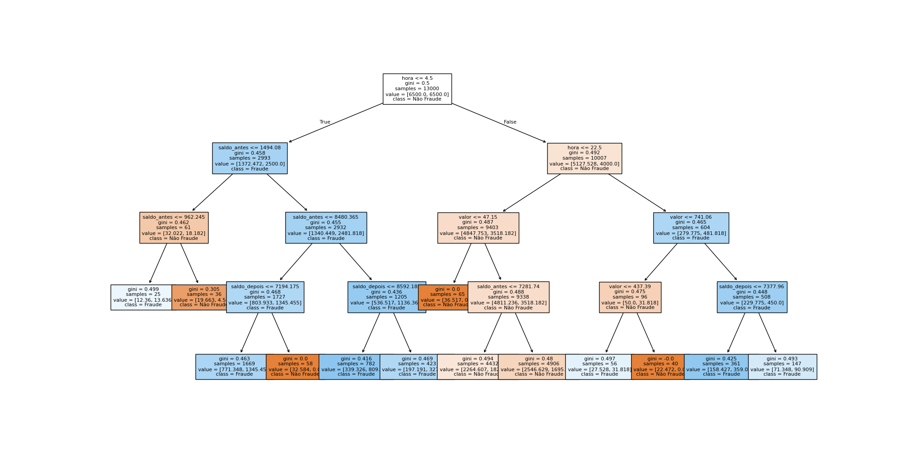

# Modelo: Árvore de Decisão - Identificador de Fraudes
Um modelo em **Árvore de Decisão** para prever se uma transação é fraude ou não, baseado nos seguintes dados do cliente:
+ Classe (0 = não é fraude, 1 = é fraude)
+ Tipo de transação (Saque, PIX, Crédito, Débito)
+ Valor da transação
+ Valor antes da transação
+ Valor após a transação
+ Horário da transação
+ ID do cliente

## Sobre o projeto
1. Trata de uma análise exploratória de dados para verificar a relação dos dados com a variável target. Feita com pandas, plotly, matplotlib e seaborn.
2. Usa-se somente as variáveis que indicam uma relação com a variável target.
3. O treinamento do modelo é feito com Stratified K-Folds e tunning de hiperparâmetros com Optuna.
4. Após o treinamento do modelo, há uma análise da qualidade do modelo, usando métrica de **Acurácia** principalmente para efeito introdutório, e **Matriz de Confusão**.
5. Ao fim é impressa a árvore de decisão.

## Tecnologias usadas
1. Python
2. Scikit-Learn
3. Gradio
4. Plotly
5. Matplotlib
6. Optuna
7. Pandas
8. Seaborn
9. Joblib
### Como preparar o ambiente
```bash
pipenv sync
pipenv shell
```
### Como rodar o código que gera o modelo
```bash
python classification_model.py
```
### Como rodar o Gradio App
```bash
python app.py
```
## Aspectos do Modelo Treinado
### Análise do cenário


1. Por uma análise geral das variáveis, vê-se que o faturamento cresce de acordo com o segmento do cliente. Contudo a faixa dos valores em Ouro, que é o segemento de maior ordem, é possível ser encontrado tanmto em silver quanto bronze.
2. Os dados de silver e bronze são muito parecidos ao fazer uma correlação com as utras variáveis, o que dificulta na previsibilidade entre um segmento e outro. Os dados estão muito concentrados nesses 2 segmentos também.
3. Além disso, há algumas variávis, como inovação, que aparentam afetar os extremos, em que ouro tem empresas com grau de inovação altos, e starter tem empresas com grau de inovação baixos. Além disso, bronze tem mais empresas com menos inovação que empresas pratas num geral.
4. Algumas variáveis não impactam muito, como o tipo de atividade da empresa e a localização da empresa.
5. A variável de invação parece ser a mais importante em seguida, o faturamento.

Na sequência faz-se uma série de testes qui-quadrados entre target e as variáveis e descobre-se que o p-valor do teste envolvendo a variável inovação e targe é 0, logo há depenbdência entre elas. Já para atividade economica e localização, o teste não sugere evidência de dependência com a variável target.


### Treinamento do modelo
Por escolha educativa, escolheu-se todas as variáveis independentes para representar o modelo. Há o uso de Stratified K-Folds para separar os dados proporcionalmente para o treinamento do modelo. A acurácia obtida pelo modelo foi de ≃ .8099, ou seja acertou 80% dos dados, o que é ok de forma geral.

Na sequência obtêm-se as métricas do modelo treinado com uma matriz de confusão:


Na diagonal pode-se ver quantos acertos houve. Nesse caso percebe que o acerto de não fraudes é grande, mas o acerto de fraudes é baixíssimo.

Com uso do Optuna, foi possível escolher os melhores hiper parâmetros para treinar o modelo, sendo estes parâmetros:
- Profundidade máxima da árvore
- Mínimo de folhas

Com os hiperparâmetros, treinou-se o modelo novamente e obteve-se a visualização da árvore decisão:




### Métricas
|Fraude|F1-Score|Accuracy|Precision|Recall|
|:---|:----:|:-----|:---:|:----:|
|Sim|0.89|0.89|-|0.89|
|Não|0.13|0.13|-|0.13|

### Conclusão

- Pela matriz de confusão, é possível enxergar que quando há uma fraude, há muitos casos de falso negativo.
- A árvore em contexto geral é satisfatória quando não é fraude, mas ruim quando é fraude.
- Pelos dados, é possível notar que os dados de fraude e não fraude são muito parecidos, logo é explicável o modelo ruim.

### Créditos
Pedro Malini, 9 de Maio de 2026 