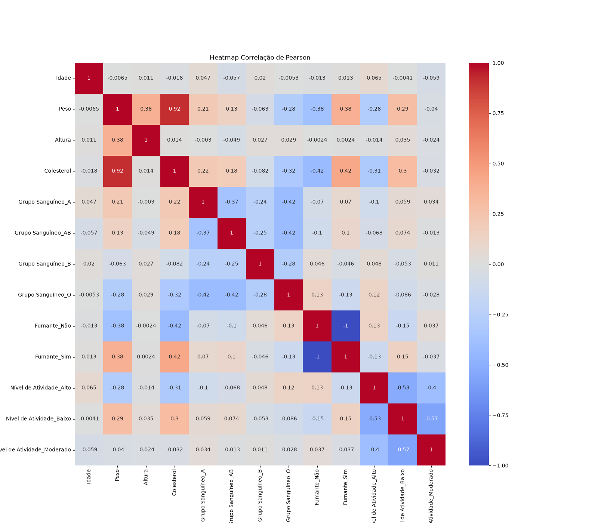
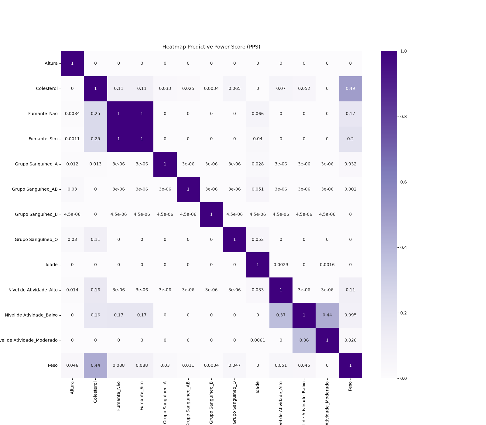
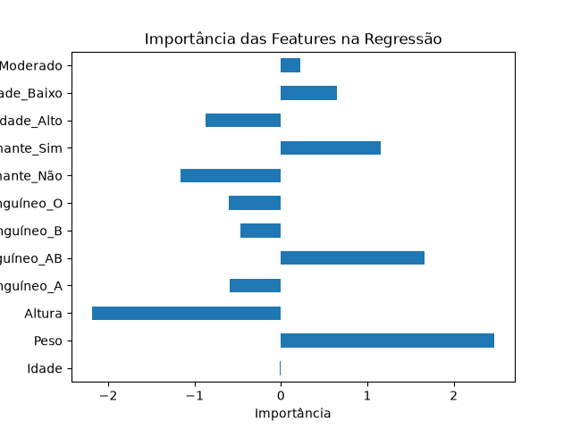
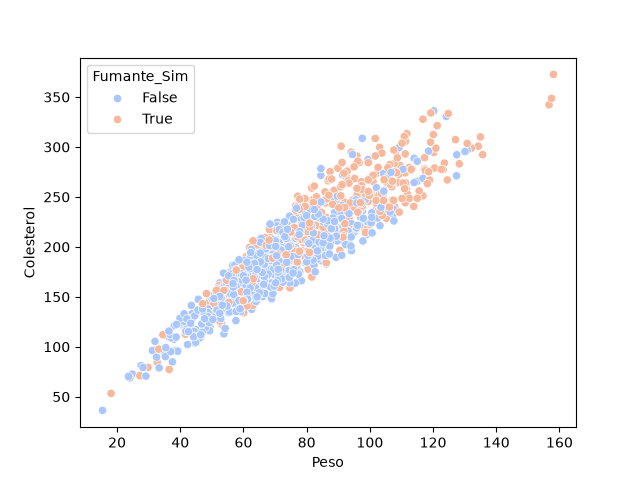
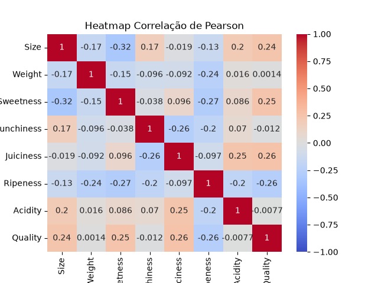
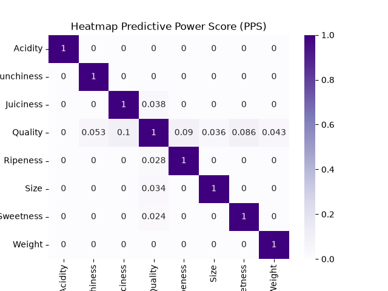
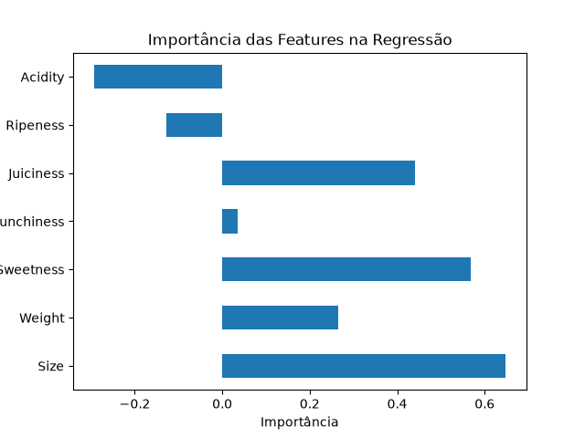

# Predictive Power Score (PPS)

## Resumo
Pegando 2 datasets utilizados em projetos anteriores dessa pasta para explorar Predictive Power Score.
1. Projeto 1: Previsão de colesterol.
2. Projeto 2: Classificador de qualidade de fruta.

### Observação
> Por se tratar de datasets já estudados, não hápreocupação aqui em separar dataframes para fazer EDA e muitos passos de análise dos dados são pulados para ir direto ao ponto do Predictive Power Score.

## Modelo de previsão de colesterol
### Correlação de Pearson

A correlação de Pearson mostra que a variável de peso explica muito bem o colesterol em uma ótica linear.

### Predictive Power Score (PPS)

Contudo o Predictive Power Score mostra que a variável Peso não é capaz de predizer tão bem assim (pontuação ≃ 0.49, em que o mínimo é 0 e o máximo é 1).

### Importância das features no treinamento

Ao treinar o modelo, obtêm-se os coeficientes de cada variável. Visivelmente, o peso foi a mais importante, seguindo o PPS e a correlação de Pearson. Porém, o coeficiente de altura foi maior que o esperado no sentido negativo, logo nem sempre as métricas vão conseguir prever qual variável será mais útil exatamente.

### Peso x Colesterol | Fumante x Colesterol

Visivelmente há uma relação entre peso e colesterol. A crescente do peso também está refletindo um crescimento no colesterol.Isso ocorre de modo quase linear. 

Além disso, ser fumante também impacta. Pelo gráfico, percebe-se que muitos fumantes nessa amostra estão com tendência ao colesterol alto, enquanto não fumantes aparecem, em geral, com colesterol mais baixo.

Portanto, o PPS falha ao dizer que ser fumante não é capaz de ajudar muito na previsão do model(fumante sim PPS ≃ 0.11).

## Modelo de classificação de qualidade de fruta
### Correlação de Pearson

A correlação de Pearson mostra que a variável target não é bem explicada por ninguém linearmente.

### Predictive Power Score (PPS)

O PPS também confirma que as variáveis não tem uma capacidade boa para predizer a variável target.

### Importância das features

Nesse caso, em que a análise não revelou variáveis que são capazes de classificar fortemente a variável target, obteve-se um comportamento inesperado nos coeficientes do classificador.

