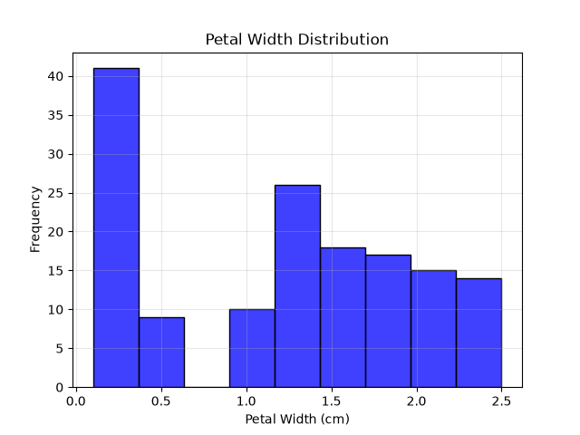
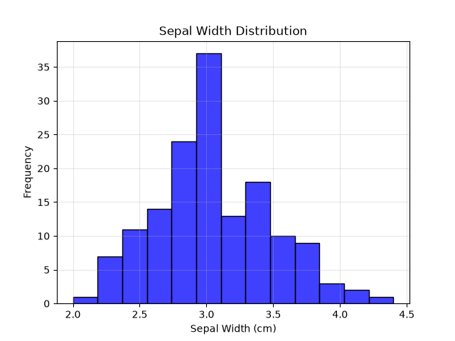
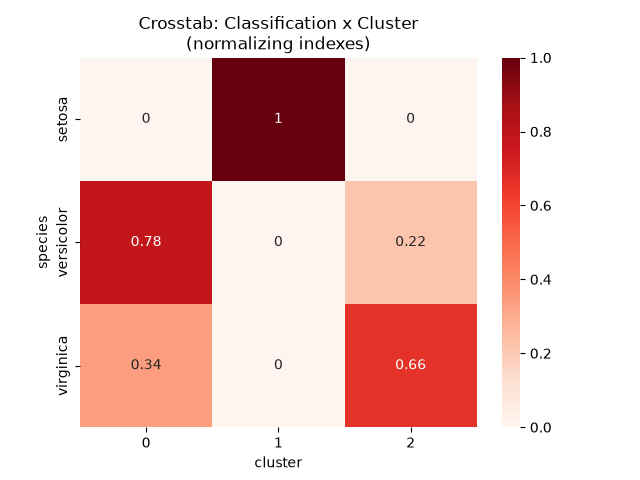
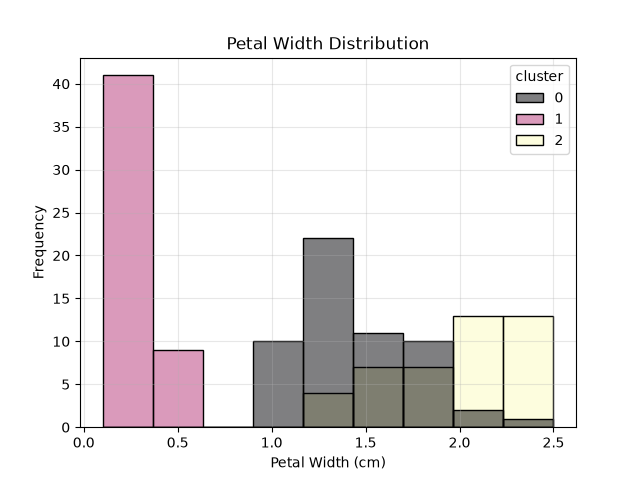
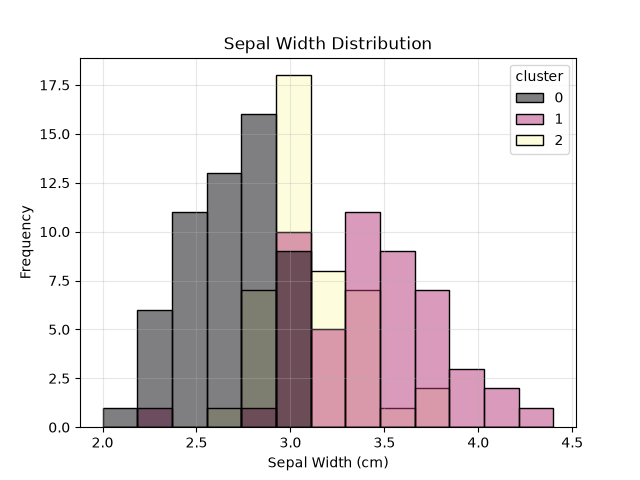

# K-Means - Conjunto de dados Iris
## Resumo
Algoritmo K-Means para agrupar as amostras do conjunto de dados Iris, otimizando os hiperparâmetros do modelo com o auxílio da biblioteca Optuna. O dataset Iris possui 150 amostras de flores, divididas em três espécies (Setosa, Versicolor e Virginica), cada uma descrita por quatro atributos numéricos:
1. Comprimento da sépala (sepal length)
2. Largura da sépala (sepal width)
3. Comprimento da pétala (petal length)
4. Largura da pétala (petal width)

Variável Target:
- 0: setosa
- 1: versicolor
- 2: virginica

Para fim de práticas, finge-se que não se sabe quantas espécies tem no dataset.

## Rodar código
```bash
pipenv sync
pipenv shell
python k_means.py
```

## Análise de dados
### Distribuição da Largura das Pétalas


A largura das pétalas mostra que há um grupo mais a esquerda.

### Distribuição da Largura das Sépalas


A largura das sépalas não são suficientes para mostrar uma clusterização clara, pois apresenta uma distribuição praticamente normal.

## Resultados
### Heatmap crosstable entre classificação real e cluster


O heatmap mostra que as flores do tipo setosa são cmpletamente classificadas no cluster 1. Contudo o mesmo não ocorre para a espécie versicolor e virginica. Estas ficam misturadas no cluster 0 e no cluster 2. Porém, no cluster 0 há mais versicolor, e no cluster 2 há mais virginica.

Logo poderíamos dizer que os clusters representam aproximadamente:
|Cluster|Espécie|
|:-:|:-:|
|0|*Versicolor*|
|1|*Setosa*|
|2|*Virginica*|

### Distribuição da Largura das Pétalas com Cluster


A largura das pétalas mostrava que há um grupo mais a esquerda. Ele foi completamente clusterizado no cluster 1, que são as ***Setosas***. O gráfico também expressa a mistura entre flores do cluster 0 e 2.

### Distribuição da Largura das Sépalas com Cluster


A largura das sépalas não foi suficiente para mostrar uma clusterização clara, pois mostra uma mistura dos dados, mesmo que estejam clusterizados. Contudo, revela-se mais expressivo para separar o cluster 0 e o cluster 2, que terminaram misturados.

## Conclusão
1. O modelo conseguiu prever como o esperado que existem 3 espécies.
2. O modelo atingiu uma pontuação de silhueta em 0.4885, o que é próximo do razoável(0.5), mas não expressa um agrupamento forte.

## Créditos
Pedro Malini, 03 de Julho de 2026
