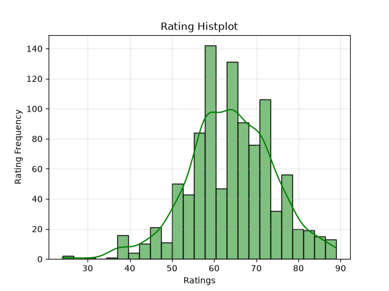
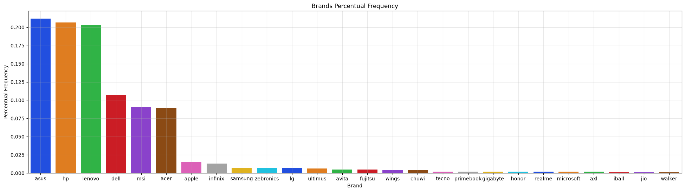
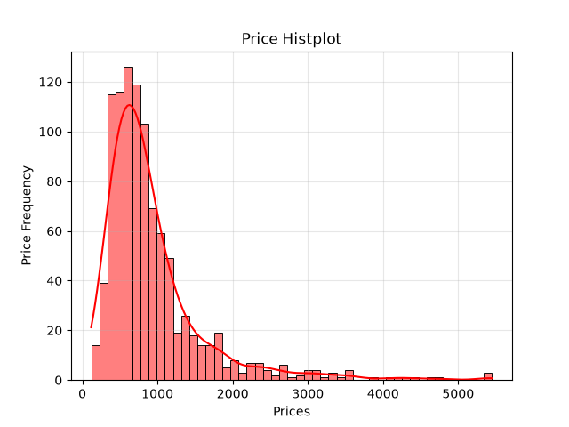
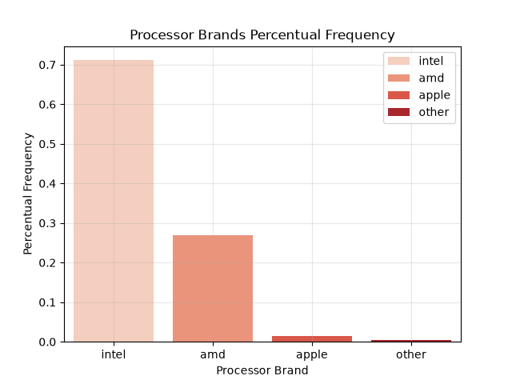
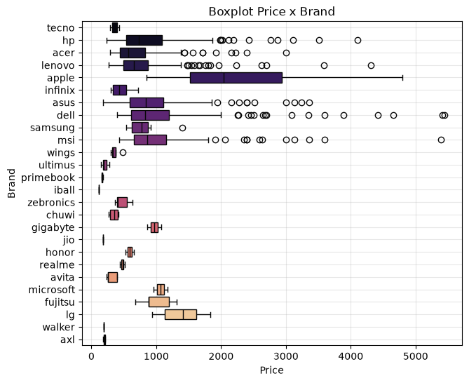
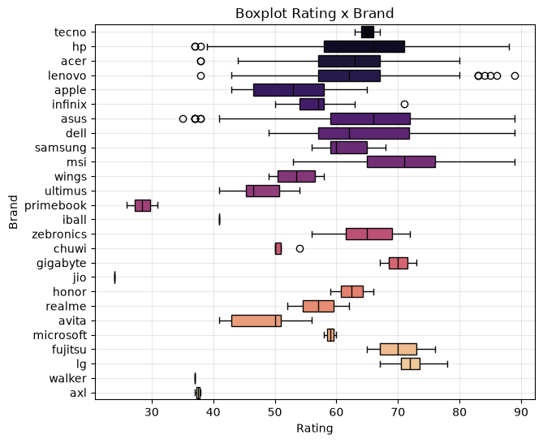
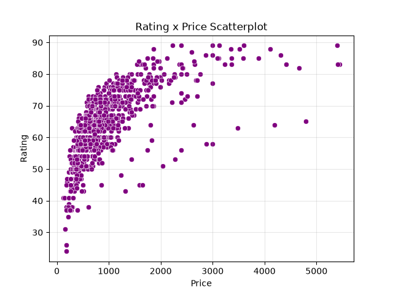
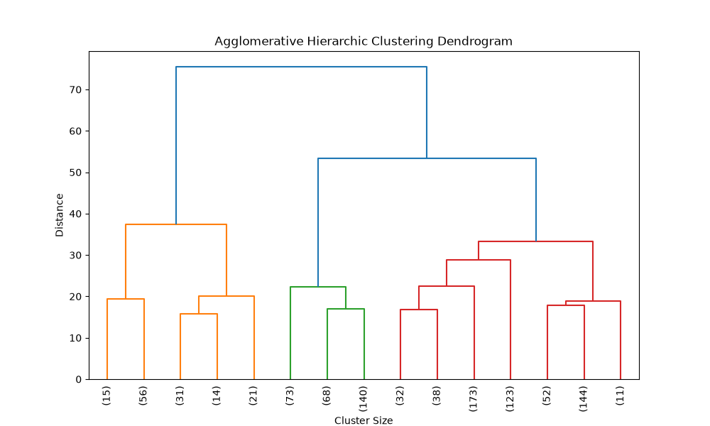
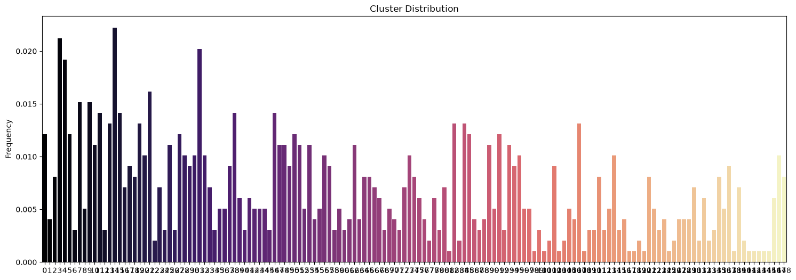
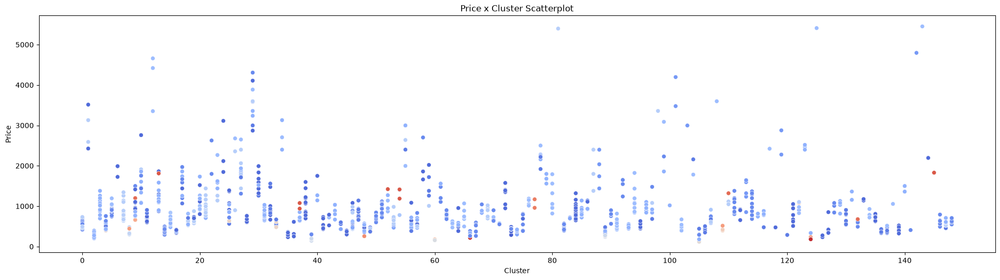

# Clusterização Hierárquica

## Resumo
Algoritmo de clusterização hierárquica de computadores, de acordo com seus dados:
1. Marca do aparelho
2. Descrição do laptop
3. Preço (USD)
4. Avaliação
5. Marca do processador
6. Classe do processador
7. Número de núcleos
8. Número de threads
9. Memória RAM
10. Memória primária
11. Memória secundária
12. Marca do núcleo
13. Tipo de núcleo
14. Touch Screen (Sim/Não)
15. Tamanho da tela
16. Largura da resolução
17. Altura da resolução
18. Sistema operacional
19. Anos de garantia

## Rodar app de consulta
```bash
pipenv sync
pipenv shell
streamlit run app.py
```
## Análise de Dados
### Colunas inúteis
1. *index* = representa o id. Não faz sentido agrupar pelo id.
2. *model* = representa a descrição do computador. Não faz sentido agrupar pela descrição do computador.

### Distribuição de Avaliação


Distribuição grosseiramente normal.

### Distribuição de Marcas de Laptop


Cerca de 6 marcas representam 80% dos dados.

### Distribuição de Preços


Distribuição normal assimetrica a direita claramente.

### Distribuição de Marcas de Processador


Processadores Intel e AMD são praticamente todos os dados (≃ 97%)

### Boxplot Preços por Marca


Muitas marcas tem outliers de preços elevados

### Boxplot Avaliação por Marca


Há poucos outliers de avaliação.

### Scatter Avaliação e Preço


Aparenta ter uma relação não linear entre preço e avaliação.

## Análise dos dados agrupados pelo modelo
### Escolha do melhor modelo
Após tuning de hiperparâmetros com Optuna, escolheu-se o modelo aglomerativo, pois apresentou maior ***silhouette score***.

|Método de Clusterização Hierárquica|Silhouette Score|Clusters|
|:-:|:-:|:-:|
|Aglomerativo|≃ 0.3275|149|
|Divisivo|≃ 0.2216|141|

### Dendograma com 15 clusters


Apesar dos 15 clusters, é possível enxergar que o grupo é dividido em 3 grandes grupos na prática.

### Distribuição dos clusters


Nos 150 clusters, o maior cluster representa somente 2% da amostra. Isso revela que talvez seja fácil encontrar computadores parecidos para muitos produtos. Contudo, se esses fossem os clusters levados em consideração, com certeza seria difícil criar um modelo de classificação preciso, já que existem muitos clusters. Para isso ser possível, seria necessário um maior volume de dados.

### Distribuição de Preços e Marcas com Cluster


Muitos clusters tem uma variação de preço baixa. Contudo alguns clusters, como o Cluster 0, têm uma variação de preço muito grande. Além disso, vê-se que marcas diferentes se encontram dentro de alguns clusters.

Além disso, os clisters não aparentam ser determinados pelo preço. A título de exemplo, os 4 últimos clusters tem uma distribuição de preços parecida.

## Conclusão
- O Sillhouete Score do melhor modelo foi baixo. Logo o agrupamento não é nem considerado razoável.
- Talvez com a redução de dimensionalidade o modelo pudesse ser mais efetivo em agrupar as características. Ex: na prática, clientes não necessariamente precisam comprar modelos de computadores que sejam iguais em 17 variáveis. A semelhança pode ocorrer por características mais adequadas, como tamanho da tela, preço, marca e processador e memória. Ex: ser touch-screen não é um fator tão necessário para clusterizar computadores numa loja, já que celulares são os aparelhos mais comprados por serem touch-screen, e não computadores.

## Créditos
Pedro Sodré, 5 de Julho de 2026.