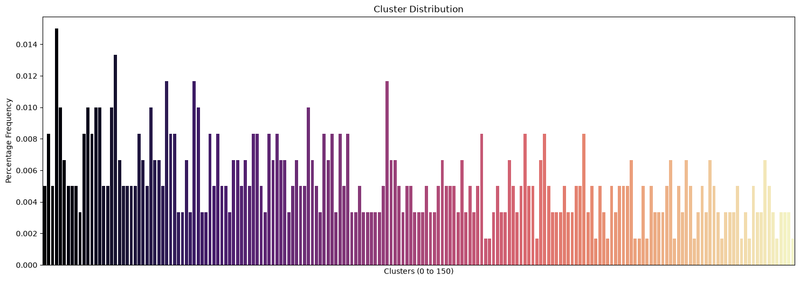

# Clusterização Hierárquica - Grupox Taxonômicos

## Resumo

Um conjunto de dados sintéticos que reúne características morfológicas, fisiológicas e comportamentais de 600 espécies fictícias. O objetivo é aplicar técnicas de clusterização hierárquica para investigar padrões de agrupamento entre as espécies, simulando processos de classificação taxonômica e relações evolutivas.

A classificação taxonômica é uma tarefa central na biologia, utilizada para compreender as relações entre organismos a partir de traços em comum. A clusterização hierárquica é um método interpretável que simula a formação de relações evolutivas entre espécies, semelhante a uma árvore filogenética.

Ressalta-se que os dados são sintéticos e não representam comportamentos ou informações de espécies reais.

## Dataset

O dataset contém 600 registros, cada um representando uma espécie fictícia. Os atributos foram gerados de forma simulada, mas baseados em princípios inspirados na biologia real.

### Atributos numéricos e booleanos

| Nome                 | Tipo   | Descrição                                               |
| -------------------- | ------ | ------------------------------------------------------- |
| `species_id`         | string | Identificador único da espécie (ex.: `SP001`)           |
| `body_mass_kg`       | float  | Massa corporal média da espécie (em kg)                 |
| `num_legs`           | int    | Número de membros locomotores (ex.: `0`, `2`, `4`, `6`) |
| `has_wings`          | bool   | Possui asas? (`1` = sim, `0` = não)                     |
| `tail_length_cm`     | float  | Comprimento médio da cauda (em centímetros)             |
| `eye_count`          | int    | Quantidade de olhos (ex.: `0`, `2`, `4`)                |
| `nocturnal`          | bool   | Ativo durante a noite? (`1` = sim, `0` = não)           |
| `avg_lifespan_years` | float  | Expectativa de vida média da espécie (em anos)          |
| `has_venom`          | bool   | Espécie possui veneno ou toxina? (`1` = sim, `0` = não) |

### Atributos categóricos

| Nome              | Tipo   | Descrição                                                       |
| ----------------- | ------ | --------------------------------------------------------------- |
| `diet_type`       | string | Tipo de dieta da espécie: `herbivore`, `carnivore`, `omnivore`  |
| `skin_type`       | string | Tipo de cobertura corporal: `fur`, `scales`, `feathers`, `skin` |
| `social_behavior` | string | Comportamento social: `solitary`, `pair-living`, `group-living` |

## Análise de Dados

### Colunas inúteis

1. *species_id* = representa o id. Não faz sentido agrupar pelo id.

## Análise dos dados agrupados pelo modelo

### Escolha do melhor modelo

Após tuning de hiperparâmetros com Optuna, escolheu-se o modelo aglomerativo, pois apresentou maior **_silhouette score_**.

| Método de Clusterização Hierárquica | Silhouette Score | Clusters |
| :---------------------------------: | :--------------: | :------: |
|            Aglomerativo             |     ≃ 0.3275     |   149    |
|              Divisivo               |     ≃ 0.2216     |   141    |

### Dendograma com 15 clusters

Apesar dos 15 clusters, é possível enxergar que o grupo é dividido em 3 grandes grupos na prática.

### Distribuição dos clusters

Nos 150 clusters, o maior cluster representa somente 2% da amostra. Isso revela que talvez seja fácil encontrar computadores parecidos para muitos produtos. Contudo, se esses fossem os clusters levados em consideração, com certeza seria difícil criar um modelo de classificação preciso, já que existem muitos clusters. Para isso ser possível, seria necessário um maior volume de dados.

### Distribuição de Preços e Marcas com Cluster

Muitos clusters tem uma variação de preço baixa. Contudo alguns clusters, como o Cluster 0, têm uma variação de preço muito grande. Além disso, vê-se que marcas diferentes se encontram dentro de alguns clusters.

Além disso, os clisters não aparentam ser determinados pelo preço. A título de exemplo, os 4 últimos clusters tem uma distribuição de preços parecida.

## Conclusão

- O Sillhouete Score do melhor modelo foi baixo. Logo o agrupamento não é nem considerado razoável.
- Talvez com a redução de dimensionalidade o modelo pudesse ser mais efetivo em agrupar as características. Ex: na prática, clientes não necessariamente precisam comprar modelos de computadores que sejam iguais em 17 variáveis. A semelhança pode ocorrer por características mais adequadas, como tamanho da tela, preço, marca e processador e memória. Ex: ser touch-screen não é um fator tão necessário para clusterizar computadores numa loja, já que celulares são os aparelhos mais comprados por serem touch-screen, e não computadores.

## Créditos

Pedro Sodré, 5 de Julho de 2026.
