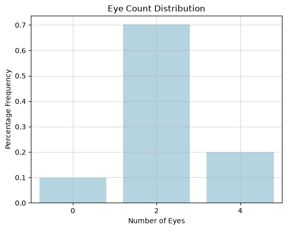
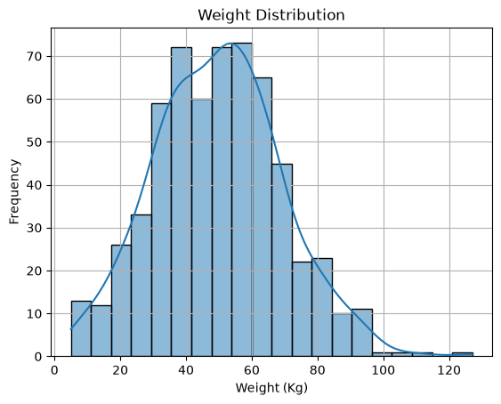
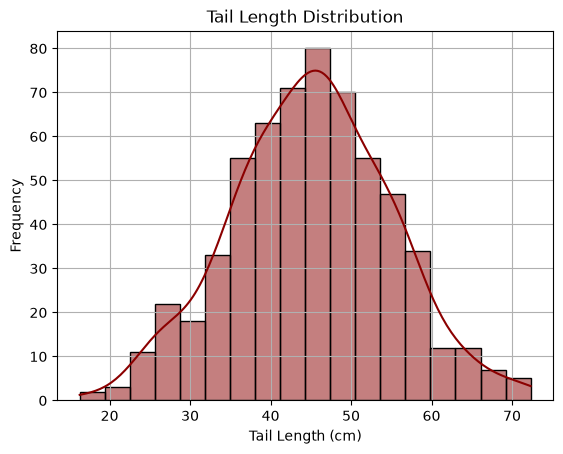
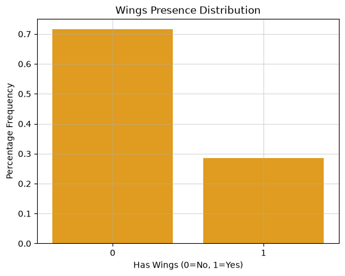
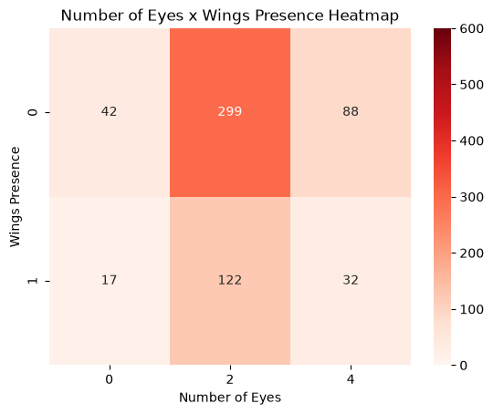
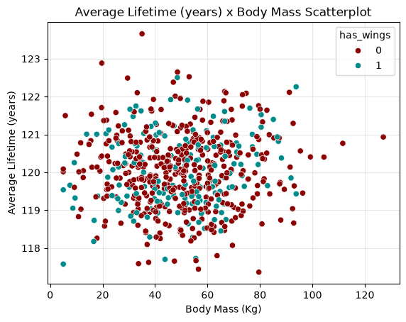
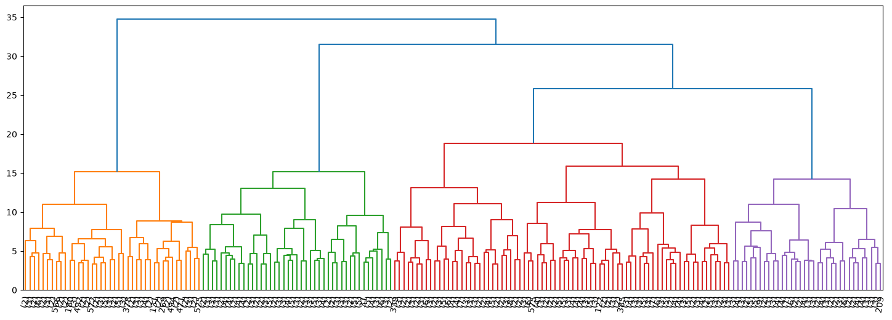
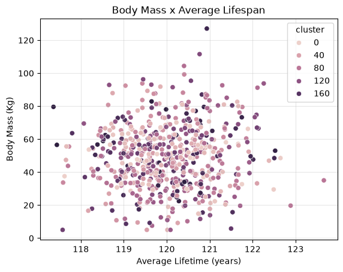

# Clusterização Hierárquica - Grupox Taxonômicos

## Resumo

Um conjunto de dados sintéticos que reúne características morfológicas, fisiológicas e comportamentais de 600 espécies fictícias. O objetivo é aplicar técnicas de clusterização hierárquica para investigar padrões de agrupamento entre as espécies, simulando processos de classificação taxonômica e relações evolutivas.

A classificação taxonômica é uma tarefa central na biologia, utilizada para compreender as relações entre organismos a partir de traços em comum. A clusterização hierárquica é um método interpretável que simula a formação de relações evolutivas entre espécies, semelhante a uma árvore filogenética.

Ressalta-se que os dados são sintéticos e não representam comportamentos ou informações de espécies reais.

## Dataset

O dataset contém 600 registros, cada um representando uma espécie fictícia. Os atributos foram gerados de forma simulada, mas baseados em princípios inspirados na biologia real.

### Atributos numéricos e booleanos

| Nome                 | Tipo   | Descrição                                               |
| -------------------- | ------ | ------------------------------------------------------- |
| `species_id`         | string | Identificador único da espécie (ex.: `SP001`)           |
| `body_mass_kg`       | float  | Massa corporal média da espécie (em kg)                 |
| `num_legs`           | int    | Número de membros locomotores (ex.: `0`, `2`, `4`, `6`) |
| `has_wings`          | bool   | Possui asas? (`1` = sim, `0` = não)                     |
| `tail_length_cm`     | float  | Comprimento médio da cauda (em centímetros)             |
| `eye_count`          | int    | Quantidade de olhos (ex.: `0`, `2`, `4`)                |
| `nocturnal`          | bool   | Ativo durante a noite? (`1` = sim, `0` = não)           |
| `avg_lifespan_years` | float  | Expectativa de vida média da espécie (em anos)          |
| `has_venom`          | bool   | Espécie possui veneno ou toxina? (`1` = sim, `0` = não) |

### Atributos categóricos

| Nome              | Tipo   | Descrição                                                       |
| ----------------- | ------ | --------------------------------------------------------------- |
| `diet_type`       | string | Tipo de dieta da espécie: `herbivore`, `carnivore`, `omnivore`  |
| `skin_type`       | string | Tipo de cobertura corporal: `fur`, `scales`, `feathers`, `skin` |
| `social_behavior` | string | Comportamento social: `solitary`, `pair-living`, `group-living` |

## Análise de Dados

### Colunas inúteis

1. _species_id_ = representa o id. Não faz sentido agrupar pelo id.

### Distribuição de Número de Olhos

70% dos dados tem 2 olhos, 10% tem 1 olho e 20% tem 4 olhos. Isso é um bom indicador que é possível clusterizar os dados de alguma forma com esse desbalanceio.

### Distribuição de Peso

O peso segue uma distribuição bem próxima de uma distribuição normal.

### Distribuição de Tamanho da Cauda (cm)

O tamanho da cauda segue uma distribuição bem próxima de uma distribuição normal.

### Distribuição de Presença de Asas

A maioria das espécies não tem asas, o que pode ser um bom sinal de clusters para aves/insetos voadores.

### Heatmap Pesença de Asas x Número de Olhos

Quase metade dos dados(299/300) tem 2 olhos e não tem asas. O resto está dividido nas outras 5 seções possíveis.

### Tempo de Vida Médio (anos) x Massa Corporal (kg)

Não há uma relação clara entre tempo de vida médio e massa corporal. Inclusive, a presença de asa também não aparenta influenciar essa relação.

## Análise dos dados agrupados pelo modelo

### Escolha do melhor modelo

Após tuning de hiperparâmetros com Optuna, escolheu-se o modelo aglomerativo, pois apresentou maior **_silhouette score_**.

| Método de Clusterização Hierárquica | Silhouette Score | Clusters |
| :---------------------------------: | :--------------: | :------: |
|            Aglomerativo             |     ≃ 0.1457     |   193    |
|              Divisivo               |     ≃ 0.0877     |    10    |

### Dendograma com todos clusters do melhor modelo

Considerando que há 600 espécies, esse agrupament não é interessante, pois há muitos clusters para uma amostra baixa.

### Distribuição dos clusters

Nos 150 clusters, o maior cluster representa somente 1.5% da amostra. Isso não é um agrupamento efetivo, já que agrupa poucos dados, sobretudo considerando que há apenas 600 espécies no dataset.

### Scatterplot Preço x Tempo de Vida Média x Cluster

É possível ver que o cluster não consegue expressar algo nesse scatterplot.

## Conclusão

- O Silhouette Score do melhor modelo foi baixo. Logo o agrupamento não é nem considerado razoável. Talvez com uma seleção de features mais adequadas, seja possível clusterizar melhor os dados, visto que o mal da dimensionalidade afasta ainda mais os dados.
- O melhor modelo tem muitos clusters, o que mostra que o agrupamento não é bom, já que bons agrupamentos incluem muitos dados em poucos clusters idealmente.

## Créditos

Pedro Sodré, 6 de Julho de 2026.
