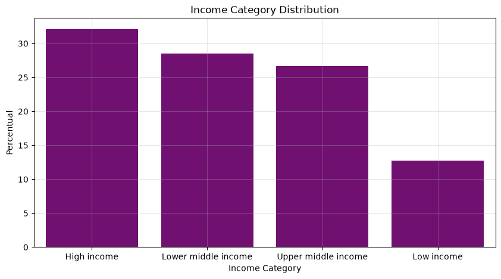
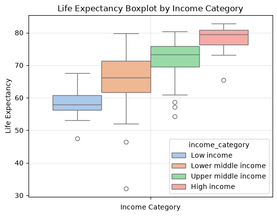
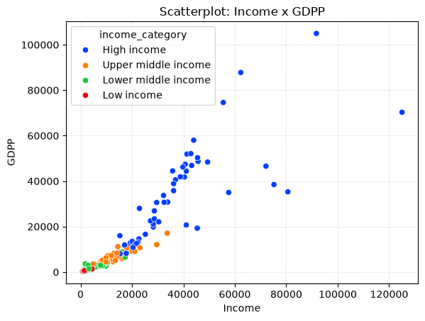
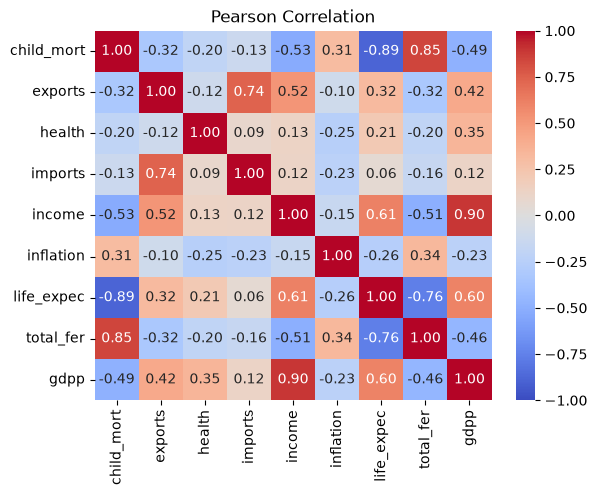
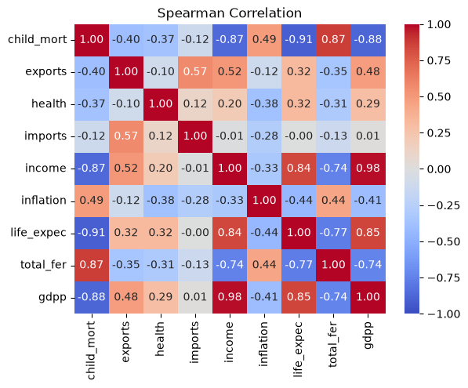

# PCA - DAtaset de Países

## Resumo
Algoritmo de redução de dimensionalidade do dataset de países

## Dataset
|Métrica|Tipo|Descrição|
|:-:|:-:|:--|
|country|str|Nome do país|
|child_mort|float|Mortalidade infantil a cada 1000 nascimentos|
|exports|float|Nível de exportação (percentual com base no PIB)|
|imports|float|Nível de importação (percentual com base no PIB)|
|health|float|Investimento em saúde (percentual com base no PIB)|
|income|int|Renda média por habitante|
|inflation|float|Inflação|
|life_expec|float|Expectativa de vida em cem anos|
|total_fer|float|Total de crianças que poderiam ter nascido pra cada mulher|
|gdpp|int|PIB per capita (PIB do país dividido pela população)|
|income_category|str|Categoria do país com base na renda (*Lower, Lower middle, Upper lower, High*)|

## Análise de Dados

### Distribuição Categoria de Renda Média

A distrbuição não é uniforme, mas há uma presença maior da classificação High Income. Isso se dá em razão de haver muitos países com pib médio, mas terem pouca gente.

### Expectativa de Vida - Boxplot

Vê-se que quanto maior a categoria do income, maiorr a expectativa de vida.

### Income x GDPP

Vê-se uma relação não linear de crescimento entre GDPP e Renda Média por Habitante. Quanto maior o PIB, maior a Renda Média por Habitante.

### Correlações
#### Correlação de Pearson

#### Corelação de Spearman

Como algumas correlações são mais próximas de lineares, e outras mais próximas de não lineares, cada forma de correlação explica de forma mais forte cada correlação entre as variáveiis.

Contudo, chama atenção que muitas variáveis têm correlações entre si.

Exemplos:
1. Mortalidade Infantil x Expectativa de Vida
2. Mortalidade Infantil x PIB
3. Mortalidade Infantil x Total de crianças que poderiam ter nascido pra cada mulher
4. Exports x Imports
5. Income x GDPP

## Erro de Reconstrução
|Componentes|Mean Absolute Error|
|:-:|:-:|
|2|0.3662302934326459|
|3|0.23847219349860976|