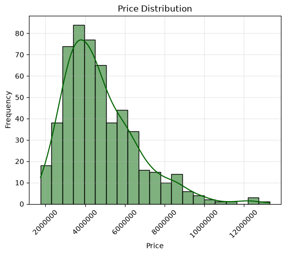
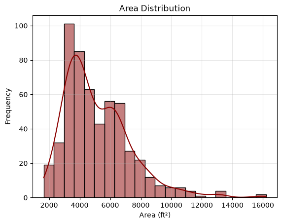
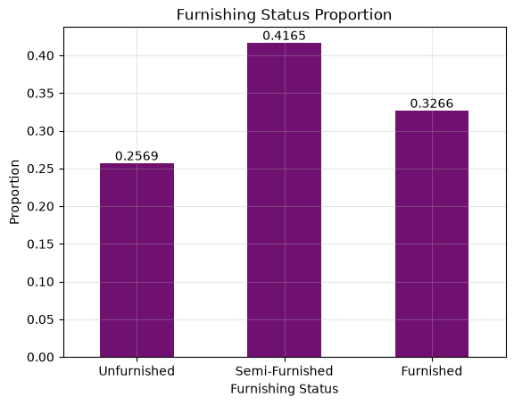
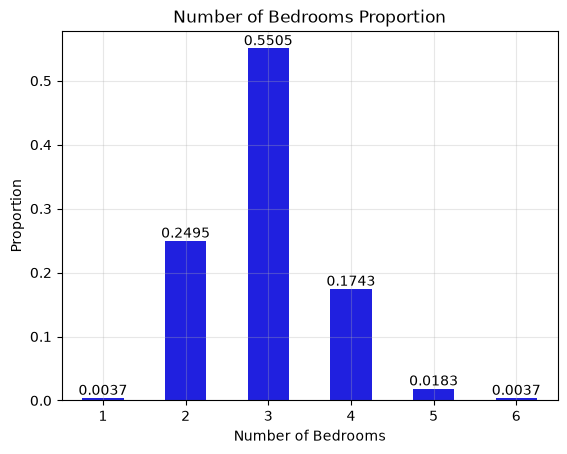
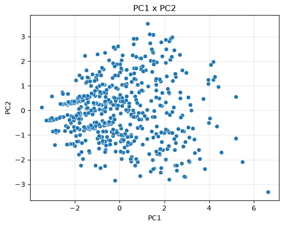
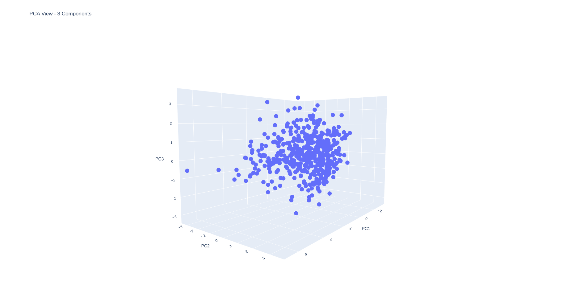

# PCA - Dataset de Casas

## Resumo
PCA para reduzir a dimensionalidade dos dados, buscando manter o máximo de informação possível. Após a redução, gera a visualização e análise dos dados transformados, além do cálculo do erro de reconstrução do dataset a partir dos componentes principais selecionados.

## Dataset
- price: Preço da casa.
- area: Área construída da casa (em pés quadrados).
- bedrooms: Número de quartos.
- bathrooms: Número de banheiros.
- stories: Número de andares (pavimentos).
- mainroad: Acesso à rua principal (yes = possui acesso, no = não possui).
- guestroom: Possui quarto de hóspedes (yes = possui, no = não possui).
- basement: Possui porão (yes = possui, no = não possui).
- hotwaterheating: Possui aquecimento de água (yes = possui, no = não possui).
- airconditioning: Possui ar-condicionado (yes = possui, no = não possui).
- parking: Número de vagas de estacionamento.
- prefarea: Localizada em área preferencial (yes = sim, no = não).
- furnishingstatus: Status de mobília da casa:
  + furnished: Casa totalmente mobiliada, pronta para morar, incluindo móveis essenciais como camas, sofás, - armários, eletrodomésticos, etc.
  + semi-furnished: Casa parcialmente mobiliada, com alguns móveis ou itens básicos, mas não completamente equipada.
  + unfurnished: Casa sem mobília, entregue vazia, sem móveis ou eletrodomésticos.

## Análise de Dados

### Distribuição Preço

A distribuição é uniforme com cauda à direita, logo os dados estão concentrados em valores mais baixos.

### Distribuição Área

A área (medida em pés quadrados) segue uma distribuição grosseiramente normal com cauda à direita, logo os valores também estão concentrados em valores mais baixos.

### Distribuição Status de Mobília

A maioria dos imóveis são semi mobiliados.

### Distribuição Número de Quartos

Mais da metade das casas apresentam 3 quartos. A distribuição é normal.

### Correlações
#### Correlação de Pearson

#### Corelação de Spearman

Não há uma correlação forte(> 0.7) entre as features. Isto é um indício que o PCA não será bom para reduzir a dimensionalidade desse problema.

## PCA - 2 Dimensões

## PCA - 3 Dimensões

## Métricas do PCA
|Componentes|Mean Square Absolute Error|R²-Score|Variância Explicada|
|:-:|:-:|:-:|:-:|
|2|0.3662302934326459|0.3174|0.3662|
|3|0.23847219349860976|0.40278|0.4673|

## Conclusão
1. A Variância Explicada pela redução de dimensionalidade está baixa para 2 e 3 componentes. Isto é evidenciado tanto pelo r²-score, que está distante de 1, e pela soma das taxas de variação, que estão longes de 1 também.
2. O erro ao quadrado absoluto médio está baixo, mas isso pode ser um reflexo da padronização causada pelos transformers.
3. Os gráficos mostram dados dispersos, sem formar um padrão linear ou uma divisão de por clusters, o que mostra a falha da aplicação do modelo.

Talvez mais componentes seriam necessários para explicar o dataset.