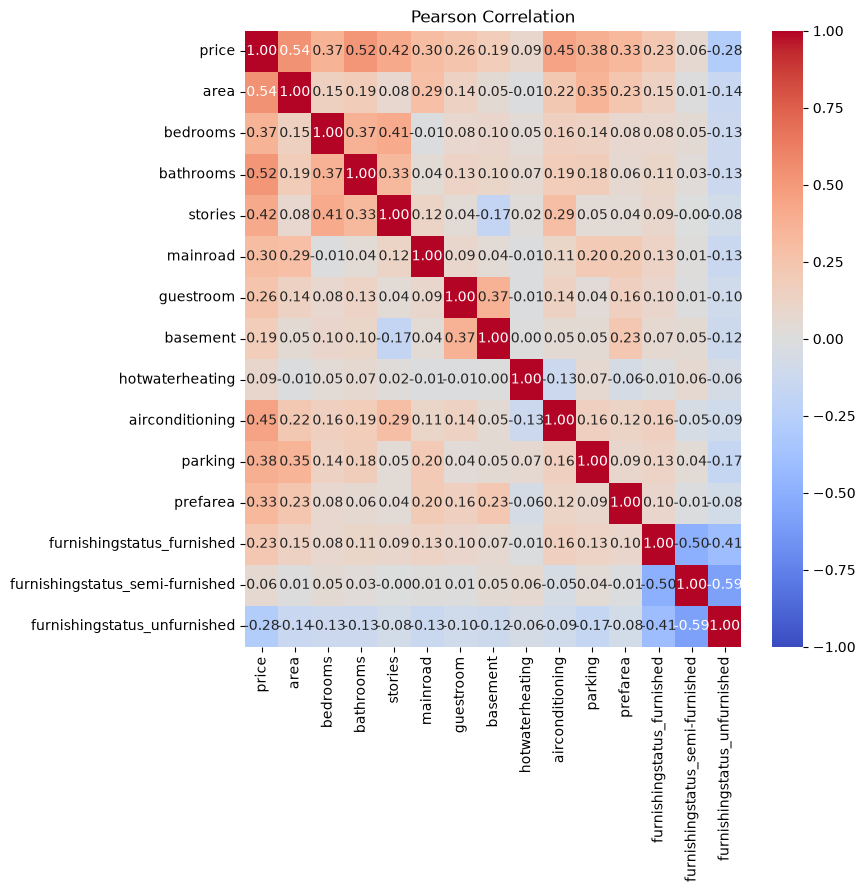
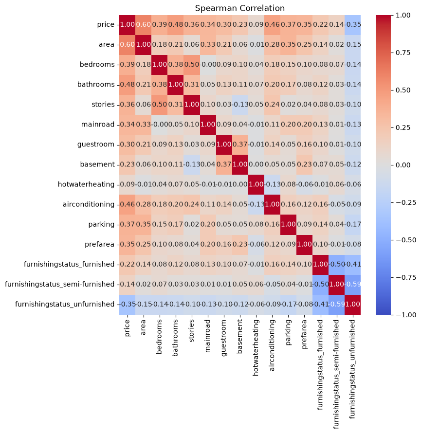

# PCA - Dataset de Casas

## Resumo
PCA para reduzir a dimensionalidade dos dados, buscando manter o máximo de informação possível. Após a redução, gera a visualização e análise dos dados transformados, além do cálculo do erro de reconstrução do dataset a partir dos componentes principais selecionados.

## Dataset
- price: Preço da casa.
- area: Área construída da casa (em pés quadrados).
- bedrooms: Número de quartos.
- bathrooms: Número de banheiros.
- stories: Número de andares (pavimentos).
- mainroad: Acesso à rua principal (yes = possui acesso, no = não possui).
- guestroom: Possui quarto de hóspedes (yes = possui, no = não possui).
- basement: Possui porão (yes = possui, no = não possui).
- hotwaterheating: Possui aquecimento de água (yes = possui, no = não possui).
- airconditioning: Possui ar-condicionado (yes = possui, no = não possui).
- parking: Número de vagas de estacionamento.
- prefarea: Localizada em área preferencial (yes = sim, no = não).
- furnishingstatus: Status de mobília da casa:
  + furnished: Casa totalmente mobiliada, pronta para morar, incluindo móveis essenciais como camas, sofás, - armários, eletrodomésticos, etc.
  + semi-furnished: Casa parcialmente mobiliada, com alguns móveis ou itens básicos, mas não completamente equipada.
  + unfurnished: Casa sem mobília, entregue vazia, sem móveis ou eletrodomésticos.

## Análise de Dados

### Distribuição Categoria de Renda Média

A distrbuição não é uniforme, mas há uma presença maior da classificação High Income. Isso se dá em razão de haver muitos países com pib médio, mas terem pouca gente.

### Expectativa de Vida - Boxplot

Vê-se que quanto maior a categoria do income, maiorr a expectativa de vida.

### Income x GDPP

Vê-se uma relação não linear de crescimento entre GDPP e Renda Média por Habitante. Quanto maior o PIB, maior a Renda Média por Habitante.

### Correlações
#### Correlação de Pearson

#### Corelação de Spearman

Como algumas correlações são mais próximas de lineares, e outras mais próximas de não lineares, cada forma de correlação explica de forma mais forte cada correlação entre as variáveiis.

Contudo, chama atenção que muitas variáveis têm correlações entre si.

Exemplos:
1. Mortalidade Infantil x Expectativa de Vida
2. Mortalidade Infantil x PIB
3. Mortalidade Infantil x Total de crianças que poderiam ter nascido pra cada mulher
4. Exports x Imports
5. Income x GDPP

## Erro de Reconstrução
|Componentes|Mean Absolute Error|
|:-:|:-:|
|2|0.3662302934326459|
|3|0.23847219349860976|