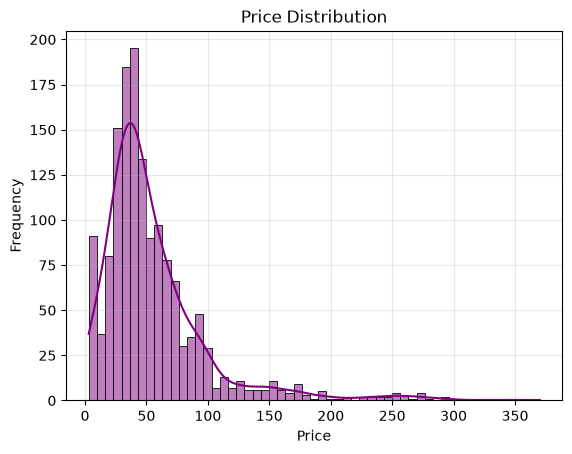
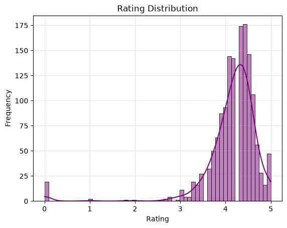
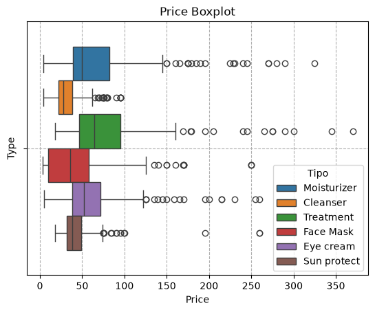
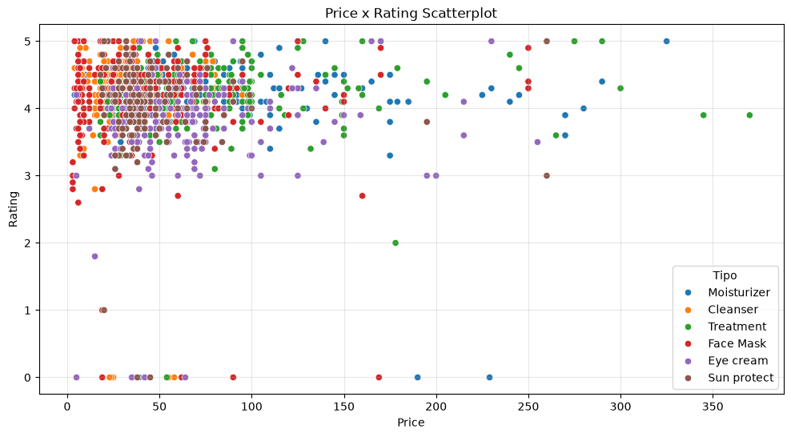
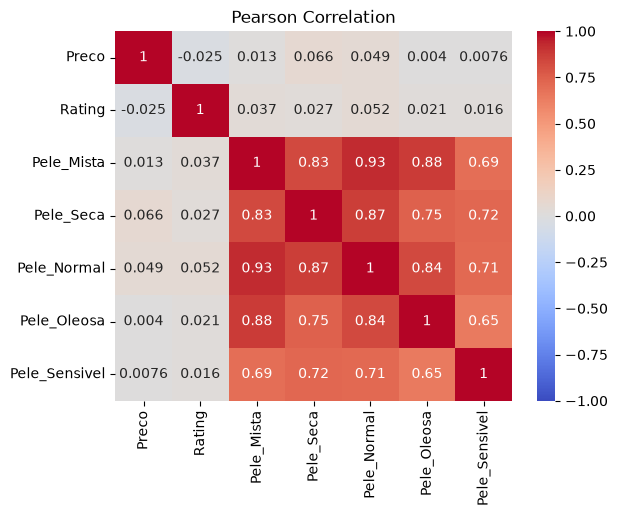
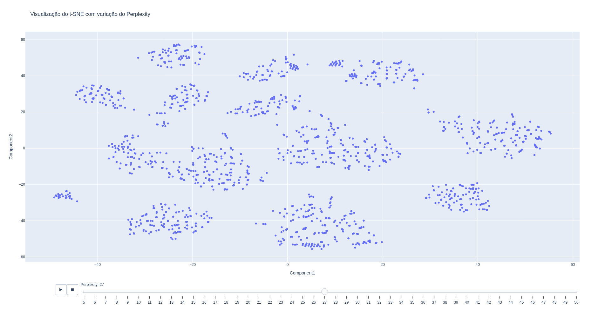
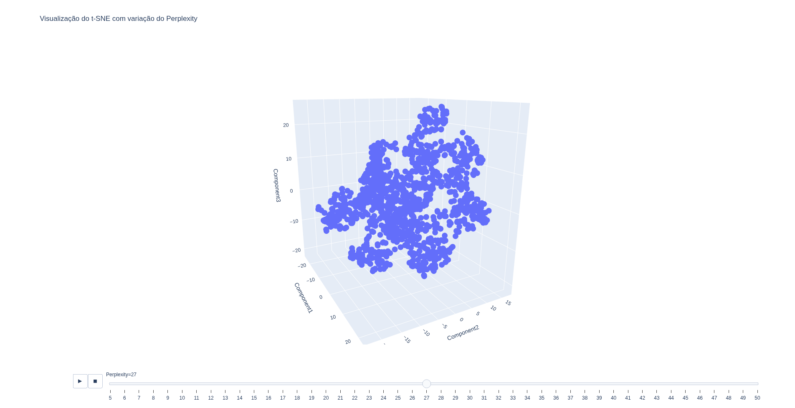

# t-SNE 

## Resumo
Uso do algoritmo t-SNE para agrupar cosméticos com dados em alta dimensionalidade em 2D.

## Dataset
|Feature|Tipo|Descrição|
|:-:|:-:|:--|
|Ingredientes|str|Lista de ingredientes/componentes do produto|
|Marca|str|Marca do produto|
|Nome|str|Nome do produto|
|Pele Mista|int|Serve para pele mista (0- Não, 1-Sim)|
|Pele Normal|int|Serve para pele em estado normal (0- Não, 1-Sim)|
|Pele Oleosa|int|Serve para pele oleosa (0- Não, 1-Sim)|
|Pele Seca|int|Serve para pele seca (0- Não, 1-Sim)|
|Pele Sensível|int|Serve para pele sensível (0- Não, 1-Sim)|
|Preço|int|Preço do produto|
|Rating|float|Avaliação do produto (0-5)|
|Tipo|str|Tipo do produto|

## Análise de Dados Univariada
### Distribuição do Preço

O preço segue aproximadamente uma distribuição normal com cauda à direita. A maioria das amostras estão entre 0 e 100 unidades monetárias.

### Distribuição da Avaliação

A avaliação segue aproximadamente uma distribuição normal com cauda à esquerda. A maioria das amostras estão em uma avaliação entre 3 e 5.

## Análise de Dados Bivariada
### Boxplot de Preço com Tipo do Produto

Produtos de tratamento são mais caros no geral, já que a mediana é a maior. Além, disso, produtos de proteção solar e de limpeza têm preços próximos quando olha-se especificamente para cada um deles, pois apresentam uma amplitude menor que os demais tipos.

### Preço x Avaliação

A relação entre preço e avaliação não forma um padrão claro. Produtos mais caros assumem avaliações baixas e altas, enquanto também há produtos mais baratos assumindo avaliações baixas e altas.

### Correlação de Pearson

Como se pode ver, muitas variáveis são explicadas por outras, menos preço e avaliação, que não assumem uma correlação tão forte no dataset. Logo é plausível um algoritmo de redução de dimensionalidade.

## Algoritmo t-SNE para redução de dimensionalidade
O algoritmo foi realizado no seguinte passo a passo:
1. Remoção das colunas nome, pois o nome funciona como um id.
2. Remoção das colunas ingredientes, pois atua como uma descrição do produto, o que levaria a um processamento de linguagem para destrinchar melhor.
3. Aplicação de Standard Scaler nas colunas numéricas não binárias.
4. Aplicação de One Hot Encoder nas colunas categóricas(Tipo e Marca).
5. Preservação de colunas binárias.
6. Tuning do hiperparâmetro perplexity, usando 2 componentes e 3 componentes- Testou-se o parâmetro perplexity em valores entre 5 e 50. Fixou-se os parâmetros de máximo de iterações para '1000' e o padrão de início para 'aleatório'.

## Visualização de Resultados
### 2D - Perplexity 27

### 3D - Perplexity 27

Embora não seja tão claro, ao rotacionar o gráfico 3d, vê-se que há um agrupamento considerável.

## Conclusão
O algoritmo t-SNE permitiu a visualização clara de dados clusterizados, mas foi custoso computacionalmente, o que mostra sua demora de execução.

Nesse projeto não foi realizado uma métrica de avaliação do modelo, mas como há 2 colunas(Rating e Preço) que não tem correlação com ninguém, dificilmente seria possível refletir o dataset em 2 colunas. Já para 3 colunas, talvez um resultado razoável fosse atingido, já que as demais variáveis binárias se explicam fortemente (Talvez a variável marca e tipo sujassem esse dataset com 3 colunas).

## Data de Conclusão
17 de Julho de 2026