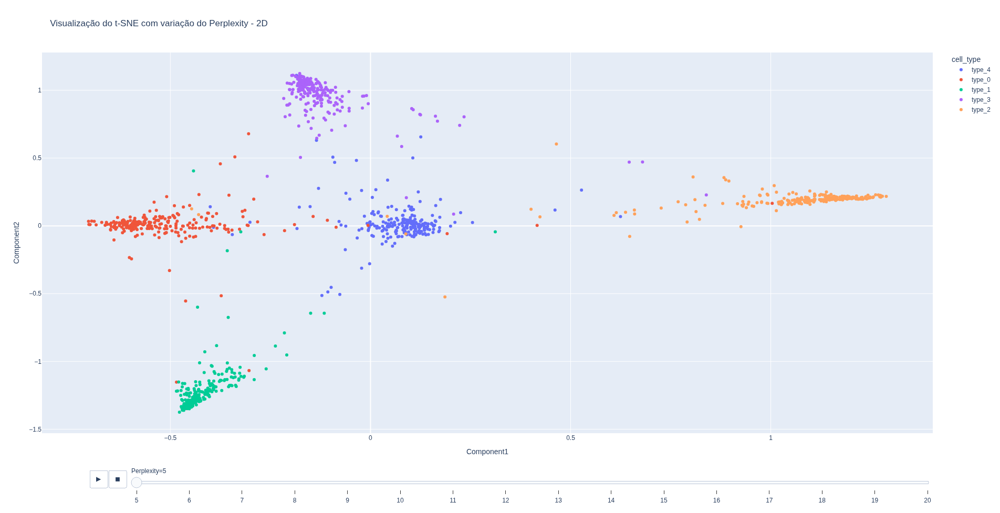
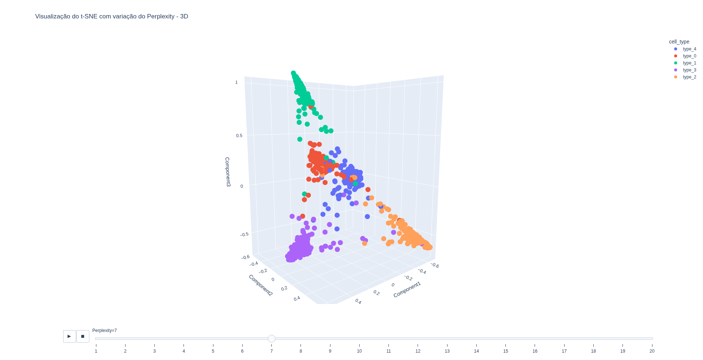

# t-SNE: Visualização Gênica de Células

## Resumo
Consiste em um algoritmo t-SNE de redução de 50 dimensões para 2D e 3D, com visualização das células separadas pelo seu tipo.

O dataset consiste de 51 colunas, em que 50 são informações gênicas e 1 coluna se refere ao tipo da célula.

As 50 colunas gênicas são usadas como dataset e passam por um Standard Scaler, já que são todas contínuas. A perplexidade é variada entre 5 e 20. O número máximo de iterações é 250. A inicialização é aleatória. Com isso, é possível ver os resultados obtidos para 2 componentes(2D) e 3 componentes(3D).

## Resultados
### 2D - Perplexity 5

### 3D - Perplexity 7

## Conclusão
É possível perceber que as células foram encontradas agrupadas muito bem em ambas dimensões de acordo com seus tipos.

## Data de Finalização
19 de Julho de 2026