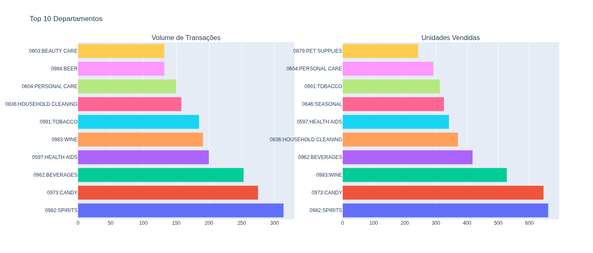
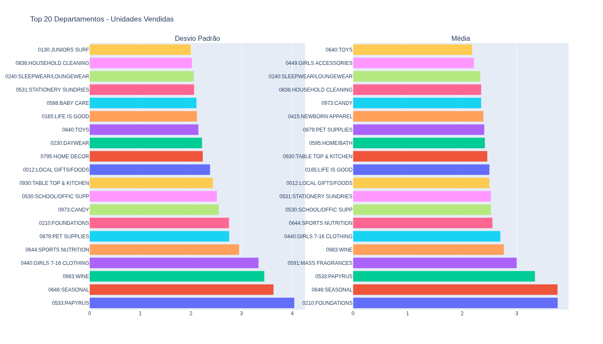
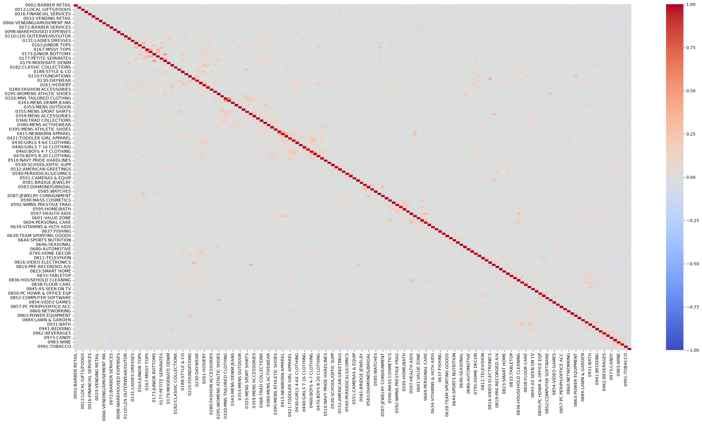

# Algoritmo Apriori = Mercado

## Resumo
1. Aplicação do algoritmo Apriori em um dataset contendo registros que significxam a venda de um produto. Cada registro contém o id da transação, o id do departamento do produto, o nome do departamento do produto e a quantidade vendida do produto naquela transação.
2. Nesse cenário, as regras de associação não são para produtos, mas sim para departamentos (ex: Vinhos, Doces, Televisão, etc..)

## Dataset
- `POS Txn` = id da transação.
- `Dept` = \<id do dep\>:\<nome do departamento\>.
- `ID` = id do de departamento em outro produto.
- `Sales U` = Quantas unidades vendidas do departamento do produto

## Análise Exploratória

### Quantidade Vendida
Algumas transações registravam quantidade <= 0 de unidades vendidas, o que não faz sentido para essa análise. Logo esses registros foram eliminados.

### Top 10 apartamentos que mais aparecem x top 10 departamentos que mais venderam

Compara-se departamentos que mais aparecem e os que tem mais unidades vendidas. Vê-se que os dois top 5 se parecem muito.

### Top 20 departamentos que mas variam no número de vendas x Top 20 departamentos que têm maior média nop número de vendas.

Vê-se que alguns departamentos que têm média alta de vendas tem uma variação alta(desvio padrão alto) no número de vendas, como o departamento de vinhos. Ou seja, possivelmente esse departamento não regisra alto número de itens por transação, mas sim tem algum outlier alto do número de vendas.

### Corelação de Pearson - Pivot Table
Realiza-se a pivot table por transação, em que os registros são as transações e as colunas são os departamentos. Marca-se 'False' quando o departamento não aparece na transação, e marca-se 'True' quando o departamento aparece na transação.

A correlação obtida mostra que há correlação nula em vários pontos, mas algumas manchas vermelhas aparecem, o que revela que alguns produtos são comprados juntos.

## Algoritmo Apriori
1. Obtém os itemsets frequentes utilizando suporte mínimo de 2%.
2. Esse valor baixo é selecionado em razão de o departamento mais frequente aparecer em aproximadamente 16% das transações apenas. Logo, a combinação deste com outros pode obter um valor no máximo igual a 16%.
3. Com isso, obtém-se somente 12 regras de associação no formato A => B, em que o tamanho máximo encontrado nos itemsets foi de 2.
4. Considerando uma confiança mínima de 40%, obtêm-se as regras de associação desejadas:
   - PERSONAL_CARE => HEALTH_AIDS (Confiança = 42.67%)
   - GENERAL_GROCERIES => BEVERAGES (Confiança = 43.43%)
   - WINE => SPIRITS (Confiança = 40.31%)