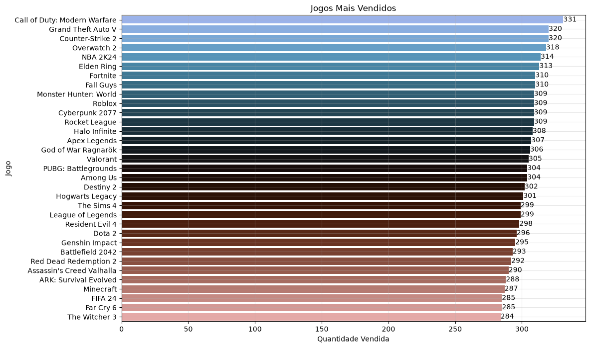
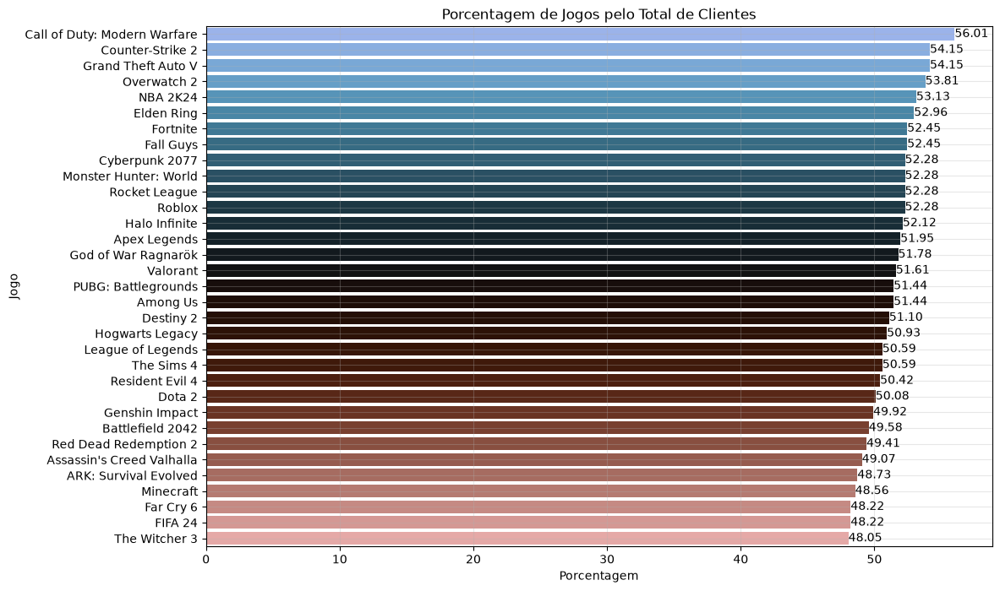
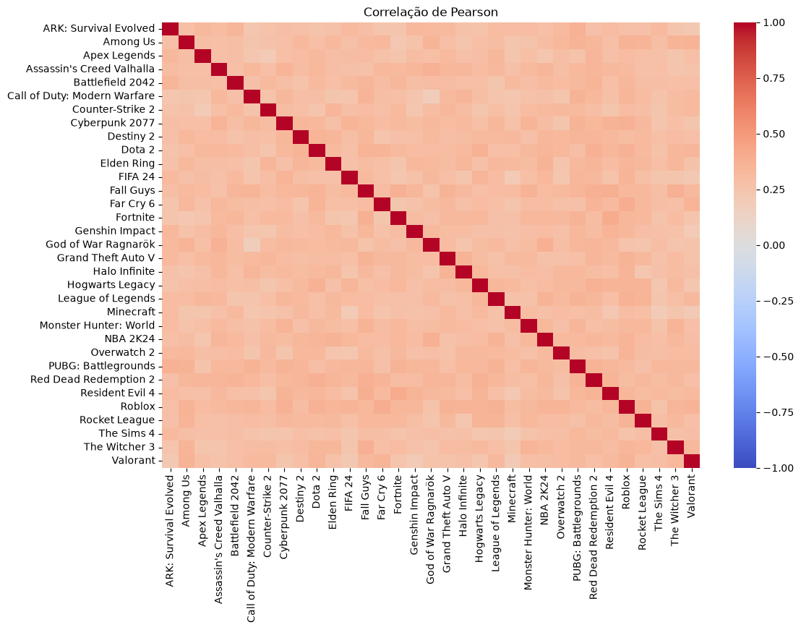

# Algoritmo Apriori - Desafio: E-commerce de Videogames

## Resumo
1. Aplicação do algoritmo Apriori em um dataset contendo registros que significam a venda de um jogo de videogame. Cada registro contém o id do cliente, o id do jogo e o nome do jogo.
2. Nesse cenário, as regras de associação são para formar relação entre a compra dos jogos.

## Dataset
- `Client ID` = ID do cliente.
- `Game ID` = ID do jogo.
- `Game Name` = Nome do jogo.

## Análise Exploratória

### Jogos que mais venderam

Considerando que há 591 clientes, a diferença entre o jogo mais vendido e o menos vendido não é tão grande(47 unidades). 47 equivale a aproximadamente 8% do total de registros.

### Percentual de Jogos que mais venderam em relação ao número total de clientes.

Considerando que o cliente só pode comprar um jogo uma vez, e que não há duplicatas no dataset, vê-se que os jogos estão bem próximos, no geral, de estarem em metade do dataset observado.

### Corelação de Pearson - Pivot Table
Realiza-se a pivot table por cliente, em que os registros são os clientes e as colunas são os jogos. Marca-se 'False' quando o cliente não comprou o jogo, e marca-se 'True' quando o cliente comprou o jogo.

A correlação obtida mostra que há correlação positiva entre quase todos os jogos no geral.

## Algoritmo Apriori
1. Obtém os itemsets frequentes utilizando suporte mínimo de 30%
2. Esse valor baixo é selecionado em razão de o suporte dos jogos estar aproximadamente 50%, logo é esperado que 2 jogos em conjuntos seja 0.5 * 0.5, o que resulta em 0.25 (25%). Como não quero selecionar o caso médio, aumento um pouco para 30%.
3. Com isso, obtém-se somente 554 itemsets frequentes, **mas isso ainda conta casos em que o tamanho do itemset 1**.
4. Considerando uma confiança mínima de 80%, obtêm-se 1 única regra de associação:
   - Fall Guys + Grand Theft Auto V => Call of Duty> Modern Warfare (confiança = 80,54%, lift = 1,44)
5. Considerando uma confiança mínima de 75%, obtêm-se as regras de associação:
   - Grand Theft Auto V + Fall Guys ⇒ Call of Duty: Modern Warfare (confiança = 80,54%, lift = 1,44)
   - Call of Duty: Modern Warfare + Grand Theft Auto V ⇒ Fall Guys (confiança = 78,76%, lift = 1,50)
   - Call of Duty: Modern Warfare + Fall Guys ⇒ Grand Theft Auto V (confiança = 78,76%, lift = 1,45)
6. Considerando uma confiança mínima de 75%, obtêm-se as regras de associação:
   - Grand Theft Auto V + Fall Guys ⇒ Call of Duty: Modern Warfare (confiança = 80,54%, lift = 1,44)
   - Call of Duty: Modern Warfare + Grand Theft Auto V ⇒ Fall Guys (confiança = 78,76%, lift = 1,50)
   - Call of Duty: Modern Warfare + Fall Guys ⇒ Grand Theft Auto V (confiança = 78,76%, lift = 1,45)
   - PUBG: Battlegrounds ⇒ Call of Duty: Modern Warfare (confiança = 73,36%, lift = 1,31)
   - Fall Guys ⇒ Call of Duty: Modern Warfare (confiança = 72,90%, lift = 1,30)
   - Far Cry 6 ⇒ Roblox (confiança = 72,63%, lift = 1,39)
   - Red Dead Redemption 2 ⇒ Call of Duty: Modern Warfare (confiança = 72,60%, lift = 1,30)
   - Roblox ⇒ Call of Duty: Modern Warfare (confiança = 72,49%, lift = 1,29)
   - Resident Evil 4 ⇒ Fortnite (confiança = 72,48%, lift = 1,38)
   - Halo Infinite ⇒ Call of Duty: Modern Warfare (confiança = 72,40%, lift = 1,29)
   - The Witcher 3 ⇒ Fall Guys (confiança = 72,18%, lift = 1,38)
   - Cyberpunk 2077 ⇒ Call of Duty: Modern Warfare (confiança = 72,17%, lift = 1,29)
   - Assassin's Creed Valhalla ⇒ Call of Duty: Modern Warfare (confiança = 72,76%, lift = 1,30)

## Conclusão
É possível traçar algumas regras de associação que serviriam para um sistema de recomendação de jogos para consumidores, ou então para vender em combos.

## Data de Conclusão
27 de Julho de 2026