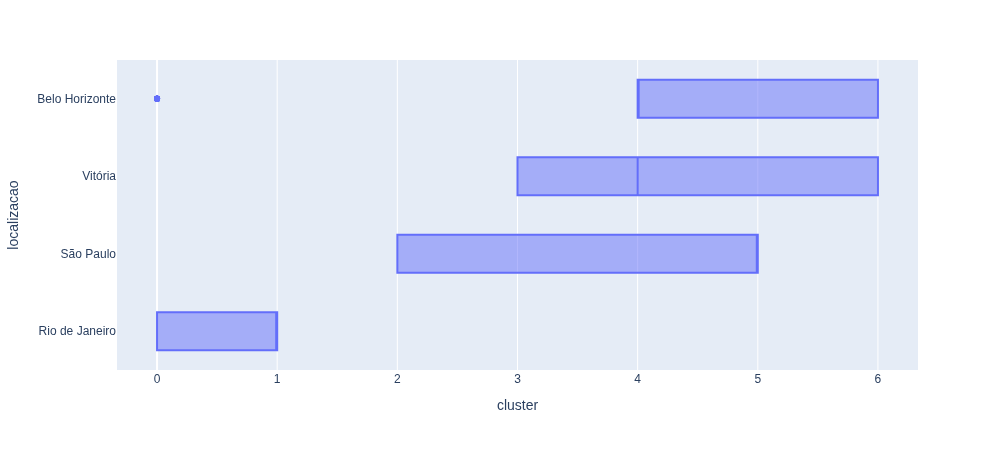
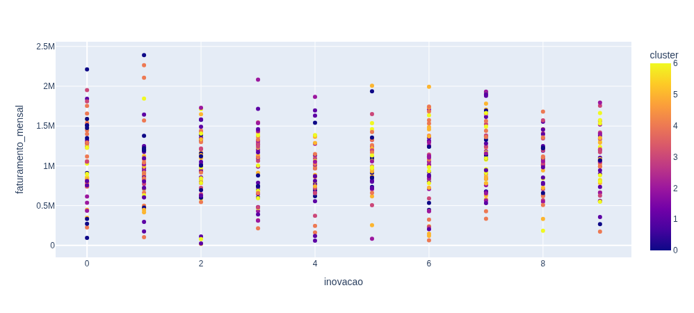

# Gaussian Mixture - Algoritmo de Clusterização de Clientes

## Resumo
- Mesmo dataset usado para a clusterização de clientes.
- Como a análise exploratória já foi realizada anteriormente sobre esse dataset, não foi feita novamente.

## Métrica
- A métrica escolhida para a seleção de melhor modelo é a ***Bayesian Information Criterion (BIC)***:
    1. BIC é um critério para a seleção de modelo em um conjunto finitio de modelos. Quanto menor o BIC, mais preferível o modelo é.
    2. BIC procura um equilíbrio entre qualidade do ajuste dos dados e da simplicidade do modelo. A ideia é que um modelo não deve se ajustar bem somente, mas sim deve usar menos parâmetros.

## Execução
1. Ler os dados
2. Transforma os dados:
   1. Variáveis numéricas contínuas são passadas pelo ***Standard Scaler***.
   2. Variáveis categóricas nominais são passadas pelo ***One Hot Encoder***.
   3. Variáveis categóricas ordinais são passadas pelo ***Ordinal Encoder***.
3. Realiza tuning de hiperparâmetros com optuna manipulando os parâmetros utilizando a mimização de *BIC*:
   1. Tipo de covariância: Assume valores em `['full', 'tied', 'diag', 'spherical']`
   2. Número de componentes (clusters): Assume valores entre 3 e 10.
4. O melhor modelo encontrado utiliza 7 clusters e covariância do tipo 'full'.

### Boxplot Cluster

As cidades aparentam impactar no cluster. O Rio de JAneiro está praticamente isolado no cluster 0 e 1.

### Faturamento x Inovação

Anteriormente, havia clusterização com 3 clusters, em que a inovação praticamente regia a clusterização. Agora, a inovação não aparenta influenciar de forma forte.

## Conclusão
1. Não forma uma explicação tão clara quanto o modelo anterior de K-Means, que era explicado puramente pelo grau de inovação.
2. Trabalhar com a segmentação dos clientes em 7 níveis não é algo fácil e usual. Logo essa clusterização não é boa para fins práticos. Mais observações poderiam ser feitas para outros modelos *Gaussian Mixture* nesse cenário, ou então seria necessário forçar o número de componentes(*clusters*) para números menores.

## Data de Conclusão
31 de Julho de 2026