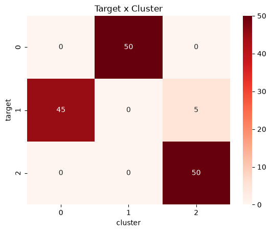

# Gaussian Mixture - Algoritmo de Clusterização de Irises.

## Resumo - Clusterização de Espécies Iris
- Mesmo dataset usado para a clusterização de iris.
- Como a análise exploratória já foi realizada anteriormente sobre esse dataset no desafio de K-Means, não foi feita novamente.

## Variável target no dataset
| Target | Espécie           |
| :----: | :---------------: |
|      0 | *Iris setosa*     |
|      1 | *Iris versicolor* |
|      2 | *Iris virginica*  |

## Métrica
- A métrica escolhida para a seleção de melhor modelo é a ***Bayesian Information Criterion (BIC)***:
    1. BIC é um critério para a seleção de modelo em um conjunto finitio de modelos. Quanto menor o BIC, mais preferível o modelo é.
    2. BIC procura um equilíbrio entre qualidade do ajuste dos dados e da simplicidade do modelo. A ideia é que um modelo não deve se ajustar bem somente, mas sim deve usar menos parâmetros.

## Execução
1. Ler os dados
2. Transforma os dados:
   1. Variáveis numéricas contínuas são passadas pelo ***Standard Scaler***..
1. Realiza tuning de hiperparâmetros com optuna manipulando os parâmetros utilizando a mimização de *BIC*:
   1. Tipo de covariância: Assume valores em `['full', 'tied', 'diag', 'spherical']`
   2. Número de componentes (clusters): Sempre 3, pois sabemos do domínio as 3 espécies.
2. O melhor modelo encontrado utiliza covariância do tipo 'full'.

### Resultado Crosstab Cluster x Target

O modelo clusterizou os dados de forma quase totalmente precisa.
Clusters obtifos ao fim representam:
   - Cluster 0: *Iris versicolor* 
   - Cluster 1: *Iris setosa*
   - Cluster 2: *Iris virginica*

## Conclusão
1. A clusterização é excelente e erra bem menos que em K-Means.
2. O grande problema está na espécie *Iris versicolor*, em que 10% de seus dados são classificados de forma errada como *Iris virginica*.

## Data de Conclusão
31 de Julho de 2026