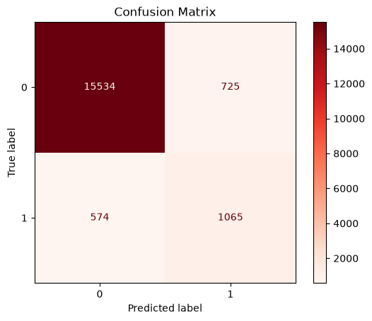

# Local Outlier Factor (LOF)

## Resumo
O *LOF* nesse exemplo é usado para encontrar anomalias, que no caso são os pulsares de nêutrons A métrica utilizada é o f1-score em razão de tanto os valores falso negativos como falso positivos serem igualmente prejudiciais ao modelo.
- Obs: a análise exploratória já havia sido feita anteriormente, logo não é repetida

## Sobre o Algoritmo Local Outlier Factor
O *LOF* assume que pontos outliers estão em zonas isoladas, logo estão em zonas de baixa densidade em relação aos vizinhos. **O algoritmo usa a distância de Minkowski com p=2 por padrão**, ou seja, a **distância euclidiana** para definir a distância entre os pontos, e assim definir os k-vizinho mais próximos.

O *LOF* recebe a manipulação do parâmetro `contamination`, que é a proporção de outliers no dataset. No caso, há cerca de 9% de Estrelas de Nêutrons Pulsares no dataset, logo entre 0.09-0.1 é o parametro passado. Esse parâmetro é usado de threshold para determinar a pontuação das amostras.

## Execução
1. Realiza a leitura do dataset.
2. Encontra a proporção de outliers para inliers usando a coluna churn. Essa proporção é passada para o parâmetro ***contamination*** do *LOF*.
3. Transforma os dados:
   1. Passa variáveis numéricas contínuas para Standard Scaler.
4. Tuning de hiperparâmetros com grid search:
   1. Usa-se as distâncias de ***Manhattan***, ***Euclidiana*** e ***Chebyshev***.
   2. Usa-se entre 1100 e 1600 vizinhos, em razão de ser aproximadamente a porcentagem de target encontrada.
   3. Usa-se a contaminação 0.1 e 0.09.
   4. Usa-se todas opções de algoritmo do modelo.
5. Escolhe o modelo que atingir melhor f1-score.
## Resultado
### Hiperparâmetros
O melhor modelo assume os seguintes parâmetros:
   1. Distância de Chebyshev
   2. Contaminação 0.1
   3. Considerando 1500 vizinhos mais próximos
   4. Algoritmo `kd_tree`

---

### F1-Score
|F1-Score|Classe|
|:-:|:-:|
|≃ 0.6211|1|
|≃ 0.96|0|

- O f1-score score é razoável para a target 1, embora não seja tão interessante. O modelo erra consideravelmente para essa classe.
- O f1-score obtido quando a target assume o valor 0 atinge 0.96, o que mostra a capacidade do modelo predizer bem essa classe. 

---

### Matriz de Confusão

A matriz de confusão mostra que o modelo é muito bom para predizer a classe 0, contudo ainda falha bastante para predizer a classe 1 e lidar com o desbalanceamento.

## Data de Conclusão
02 de Agosto de 2026.